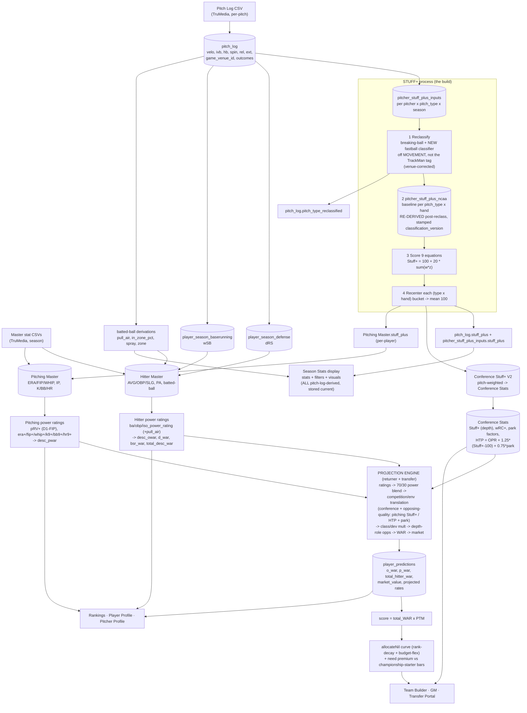

# THE PIPELINE — pitch-log upload → Stuff+ → power ratings → projections → NIL/display (2026-08-17)

The "one process." Today it's **scattered manual scripts**; the goal (Track B) is ONE function that fires on ingest and
runs the whole chain, storing everything. This doc is the map: every stage, what it computes, where it STORES (DB), and
where it DISPLAYS. Companion build plan for the Stuff+ leg: `HANDOFF_STUFF_PLUS_2026_08_16.md`.

## Flow diagram

## ★ KEY CALCULATIONS + PRINCIPLES (Trevor 2026-08-17) — how each aggregate is actually computed
- **The pitch log is the PRIMARY source of truth (highest-frequency), NOT the ONLY source.** The Masters' **power-rating
  INPUTS** — hitter batted-ball + discipline metrics (exit velo, barrel, ev90, pull_air, chase, contact, la, gb, …) AND
  pitcher rate stats — are **pitch-log-derived**, then **married onto the Masters** (they are NOT native Master columns).
  The power ratings (`ba/obp/iso_power_rating`, `pRV+`, `era⁺/fip⁺/whip⁺/…`) and thus `desc_owar/d_war/bsr_war/
  total_desc_war` / `desc_pwar` all flow from pitch-log data. `pull_air / in_zone / spray / zone` = derived-from-pitch-log,
  married on (agreed).
- **★ HITTING/PITCHING MASTER OVERRIDES (Trevor 2026-08-17).** In SOME scenarios a Master-level override supplies values
  the pitch log can't — **baserunning above all, plus some other fields** — uploaded **less frequently than the pitch
  log**. So the re-derive pass is **pitch-log-primary + Master-override-aware**: where an override exists it WINS and the
  pitch-log re-derivation must **NOT clobber it** (same discipline as preserving coach toggles — the "one function" merges,
  never blindly overwrites). Overrides are the exception, not the norm; the pitch log still drives the vast majority.
- **Conference Stuff+ (V2, canonical) =** the **pitch-weighted mean of EVERY pitcher in the conference across the FULL
  season**: `Σ(pitcher Stuff+ × his pitch count) / Σ(pitch count)`. It is the conference's **pitching depth/quality**.
- **Conference HTP =** the same idea for **hitters** — the conference's aggregate hitter talent across ALL its teams,
  full season. `HTP = OPR + 1.25·(Stuff+−100) + 0.75·park` (post wRC+→park swap).
- **Conference stats are CONFERENCE-vs-CONFERENCE only.** The conference is the unit of comparison — the aggregates rank
  conferences against each other (how tough is conf X vs Y). That comparison is exactly what the projection
  competition-translation lever consumes (a player projected INTO conf X faces conf X's Stuff+ / HTP).
- **Projections must FILL the snapshots WITHOUT touching toggles.** The returner/transfer recompute writes
  `player_snapshot` / `transfer_snapshot` **preserving any coach-set toggles** (dev aggressiveness, roster status, class
  transition, cornerstone) — never resets them — and **refreshes ALL displayed metrics to the most current values** (this
  is Step 7c).
- **Savant is DEAD/unused** — clear it after this work (logged to memory). The live surface for pitch-log stats is the
  **Season Stats display**; every stat, filter, and visual there must be pitch-log-derived + stored up-to-date.
- **Park factors = re-evaluate AFTER Stuff+ (quick).** [[project_park_factor_rework]] — next-after-Stuff+, small pass.

## Stage table (compute → store → display)

| # | Stage | Computes | Stores (DB) | Displays |
|---|---|---|---|---|
| 1 | Ingest | — | `pitch_log` (per-pitch); `Hitter Master`/`Pitching Master` (season stats) | — |
| 2 | Derive from pitch_log | Stuff+ inputs, dRS defense, wSB baserunning, pull_air/in_zone/spray/zone (+ all power-rating inputs) | `pitcher_stuff_plus_inputs`, `player_season_defense`, `player_season_baserunning`, **married onto the Masters** | Season Stats display |
| 3 | **Stuff+** (the build) | reclassify → re-derive baseline → 9-eq score → recenter | `pitch_log.stuff_plus` + `.pitch_type_reclassified`, `pitcher_stuff_plus_inputs.stuff_plus`, `pitcher_stuff_plus_ncaa`, `Conference Stuff+ (V2)`, `Pitching Master.stuff_plus` | Season Stats display (Stuff+, pitch mix) |
| 3b | **Season-stats dimension aggregation** (needs 3 done + Hitter Master top-quartile for `vs_top_hitters`) | per-dimension slash line + rates + by-pitch-type across splits: `all, vs_lhp/rhp, vs_92plus, vs_stuff_100/105plus, vs_fastball/breaking/offspeed, vs_top_hitters` (48 aggs / 10 dims) | `pitch_log_hitter_totals`, `pitch_log_pitcher_totals`, `*_by_pitch_type` (keyed `dimension_key`) | **Season Stats display** (`/stats` → `PitchLogSection`). ⚠ currently OFFLINE `scripts/aggregate_pitch_log_dimensions.ts` → Track B must absorb here; `conf_only`/intra-conf split not built. |
| 4 | Power ratings (Masters) | hitter ba/obp/iso ratings (+pull_air) → desc WAR; pitcher pRV+/era⁺/… → desc pWAR | `Hitter Master` + `Pitching Master` (ratings + `desc_*` / `total_desc_war` cols) | Player/Pitcher Profile, Rankings |
| 5 | Conference baselines | Conf Stuff+ (depth), wRC+, park factors, HTP | `Conference Stats` | Team Builder context |
| 5.5 | **Projection calibration (NEW, 2026-08-24)** | per-stat mean + TWO-SIDED SD (`sd_good`/`sd_bad`) on the qualified pop (min IP/AB) + `pr_sd` from stage-4 ratings — fixes the z-shift over-projecting elite (impossible HR9/ERA) | `model_config` (per-stat `*_sd_good`/`*_sd_bad`/`*_ncaa_avg`/`*_qual_min`) | (feeds stage 6) — see `AGENT_LEARNINGS_projection_calibration_two_sided_sd_2026_08_24.md`. NOT built yet. |
| 6 | Projections | returner + transfer engine (blend → competition translation via Stuff+/HTP/park → class/dev → depth-role → WAR → market); **reads stage-5.5 two-sided SDs, directional (sd_good toward elite, sd_bad toward poor)** | `player_predictions` (o_war, p_war, total_hitter_war, market_value, rates) | Rankings, Profiles, Team Builder, Transfer Portal |
| 7 | NIL + need | score = total_WAR × PTM → allocateNil curve + need premium | (computed live; GM `gm_budget.nil_allocation_mode`) | Team Builder, GM, Target Board |

## Current vs target
- **Current:** stages 2–5 (+ **3b**) are **scattered one-off scripts run by hand** (`recompute-stuff-plus`, `compute_pitch_log_stuff_plus`, `conferenceStuffPlusV2`, `populate-conference-stats-env-plus`, `aggregate_pitch_log_dimensions` (3b, season-stats splits), the Master rating stores, the conf-stats Bucket-A/OPR/HTP producers, …) — easy to forget → stale baselines/conference/season-stats values.
- **Target (Track B):** ONE function fires on pitch-log ingest and runs stages 2→3→**3b**→4→5→6 in order, stamped `classification_version` + `constants_version`, re-deriving every downstream aggregate in the same pass (no old-taxonomy means survive). 3b (season-stats splits) runs after Stuff+ (3), independent of projections (6). Stage 1 Master-CSV ingest stays a separate upload; the pipeline marries its pitch-log derivations onto the Masters.
- **Sequencing rule:** Stuff+ (stage 3) must be FINAL before the transfer recompute (stage 6, Step 6b) so projections land once. NIL's `total_hitter_war` + need-premium wiring rides the 6b/7c recompute.

---
## ★ ADD: Season-stats dimension aggregation — a MISSING edge-fn stage (2026-08-21 audit)
The player-facing **Season Stats** display (`/dashboard/player/:id/stats` → `PlayerStatsPage` → savant COMPONENT `PitchLogSection`; pitcher `/dashboard/pitcher/:id/stats`) shows a filtered slash line + rate tables across **dimension splits**: hitter `all, vs_lhp, vs_rhp, vs_92plus, vs_stuff_100plus, vs_stuff_105plus, vs_fastball, vs_breaking_ball, vs_offspeed`; pitcher `all, vs_lhp, vs_rhp, vs_fastball, vs_breaking_ball, vs_offspeed, vs_top_hitters`.
- **These are STORED + read** from `pitch_log_hitter_totals` / `pitch_log_pitcher_totals` (+ `*_by_pitch_type`), keyed by `dimension_key`. Staging: 50,418 / 37,306 rows (2026). No browser aggregation on the Stats tab. ✅
- **BUT the producer is an OFFLINE hand-run script**: `scripts/aggregate_pitch_log_dimensions.ts` (`npm run aggregate-pitch-log-dimensions -- --apply`) — NOT in the edge fn. Dry-run VERIFIED working 2026-08-21 (48 aggregations across 10 dimensions, 967 top-quartile hitter IDs resolved, exit 0). **→ Track B must ABSORB this per-dimension aggregation into the on-upload path** (same "retire the scattered scripts" goal as stages 2–5). Prod: this script must run to fill the totals tables (add to runbook if not already an explicit ordered step — currently only the `.ip` column patch F1 + team_season_stats re-source reference these tables).
- **Hitter descriptive run values (added 2026-08-26):** `scripts/aggregate_pitch_log_dimensions.ts` now calls `select populate_hitter_run_values(2026);` at the END of its run, filling `batting_rv/defensive_rv/baserunning_rv` (+ national `*_z`) on the `dimension_key='all'` rows of `pitch_log_hitter_totals` (batting from the fresh counts, defensive=drs_floor, baserunning=wsb_runs). Displayed as the "VALUE" cluster on the hitter Season Stats banner (pure-read). **→ When Track B absorbs stage 3b, it MUST also call `populate_hitter_run_values(season)` after the hitter aggregation** (needs the fresh `all`-row counts + reads `player_season_defense`/`player_season_baserunning`). `docs/AGENT_LEARNINGS_hitter_run_values_2026_08_26.md`.
- **Live-compute that remains (acceptable):** the **Visuals tab** fine filters (pitch type × zone location × batted-ball) aggregate raw `pitch_log` client-side (`PitchLogSection` `filteredPitches` useMemo). Combinatorial → arguably fine to leave live; NOT a stored-first violation worth precomputing.
- **UNBUILT (planned):** no `conf_only` (`is_conference_game`) dimension, no home/away, no date-range, no per-player intra-conf split storage (`season_stats` is a single slash line, no `*_reg`). If a conference-only toggle is wanted on the season-stats page, the edge fn needs a new `conf_only` `dimension_key` in this aggregation. [[project_conference_stats_scope_rule]]

## ★ SAVANT deletion guardrail (2026-08-21) — pages vs components
Splitting `src/savant/` for the "clear stale savant" cleanup:
- **`src/savant/pages/*`** (SavantHitterPage, SavantPitcherPage, SavantTeamProfile, SavantConferenceStats) = OLD internal pages, reachable ONLY via `/savant/*` (email-allowlist `SavantRoute`, App.tsx:150-167). NOT the coach player-eval workflow. These hold the out-of-date LIVE oWAR/pWAR (TeamProfilePage) + z×20 env+ (ConferenceStatsPage) compute. **SAFE to delete.**
- **`src/savant/components/*` + `hooks/*` + `lib/*`** (esp. `PitchLogSection`) = LOAD-BEARING for the live coach routes (`PlayerStatsPage`/`PitcherStatsPage` `/stats`, plus PlayerProfile/PitcherProfile/ReturningPlayers/GM import savant hooks+lib). **DO NOT delete** — a blanket `rm -rf src/savant` breaks the real season-stats display.
- The active coach player-eval pages are the NON-savant `PlayerProfile` / `PitcherProfile` / `PlayerHub` (App.tsx:119-123). So the "savant is not used" statement is true for savant **pages**, not savant **components**.

## ★★★ THE FORWARD RECLASSIFICATION → STUFF+ PROCESS (FINAL, Trevor-confirmed 2026-08-28). LINEAR + per-pitcher usage-weighted.
This is the committed go-forward for BOTH the prod regen AND Track B on-ingest. NO feedback loop, NO gyro_stuff_plus, NO score-flip (all dropped).
1. **CLASSIFY by the derived RANGES.** `scripts/reclassify_v2.ts`: per-pitch 10-bucket SEED (incl `FBSTRIP` = FA/SI rr∈[−4,4] strip) →
   per-pitcher cluster (merge Δarmhb<4 & Δivb<3.5 & Δvelo<2.5) → label-by-MEAN vs the CORE ranges (per-pitch×hand, handedness-normalized armHB) →
   tiebreakers (CT/SL ride-floor, gyro/curve blend). Output: clear labels + the ~8% seam-unclear flagged. (Stage-1 = 91.5% / 92.0% arsenal-mix.)
2. **TRACK USAGE %.** Per pitcher, from the CLEAR pitches, compute the % of each pitch type he throws → his true arsenal (which pitches, how much).
3. **BACKFILL the unclear ~8%.** Fold each seam-unclear pitch into the pitcher's DOMINANT CLOSE-PROXIMITY pitch — the main pitch he actually
   throws that it sits nearest to in movement → the label matches his real repertoire (a 4S guy's ambiguous fastball → his 4S; a gyro-heavy
   guy's borderline breaker → his gyro). USAGE-WEIGHTED, not just nearest. Reserve `needs_review` ONLY for genuinely distinct RARE pitches (a
   new experimental pitch), NOT seam bleed. (This is what staging did — confirmed via `reclassify_v2.ts --pitcher <id>`.)
4. **RUN THE FULL STUFF+ ONCE.** `src/savant/lib/stuffPlusEngine.ts` scores each pitch by its FINAL label via the pitch-type switch
   (`calcGyroSlider` = the SINGLE gyro eq, line 305) → recenter per (pitch_type×hand).
5. **AGGREGATE over the full season** → per-pitcher TRUE overall Stuff+ + usage %.
Prod = REGENERATE end-to-end (not copy). A2 committed writer stamps the step-3 final labels (keyset/direct-session). Full recovery detail:
`docs/STUFF_PLUS_RECLASS_HANDOFF_2026_08_28.md` + `docs/STUFF_PLUS_V2_CLASSIFIER_DESIGN_RECOVERED.md` (derived ranges §). NEXT BUILD: step 3
(usage-weighted backfill) into reclassify_v2.ts → validate vs `_reclass_result` → wire steps 4-5 (existing engine) → per-pitcher Stuff+ cross-check.

### ★ STEP 3 REFINEMENT (Trevor 2026-08-28) — the proximity gate is the whole game; fold is SEAM-LOCAL + TIGHT, never "nearest anchor"
The usage-weighted backfill applies ONLY to genuinely-borderline pitches. Three cases:
1. **Core pitch** (cluster centroid clearly inside one type's range, FAR from any seam) → KEEP its label; usage is IRRELEVANT. (e.g.
   a −15 IVB cluster is nowhere near the gyro band [−4,+4] → it stays Curve/Sweeper no matter how many gyros the pitcher throws.)
2. **Borderline** (centroid near a SEAM between two adjacent types AND within a TIGHT movement distance of one of those two seam-adjacent
   pitches the pitcher actually throws) → fold to the HIGHER-USAGE of those two. Usage only breaks the tie WHEN MOVEMENT CANNOT.
3. **Distinct but far from all his pitches** → KEEP its own label + `needs_review`. A pitcher can throw 1 of any pitch in the sport; never erase it.
GATE = tight movement distance to a SEAM-ADJACENT dominant pitch — NOT "nearest anchor" (that sloppy version would swallow legit distinct
pitches). Implement as: a cluster is fold-eligible only if it's within the tight seam band of two types AND a dominant same-region anchor exists.

## ★★★★ GO-FORWARD PLAN — COMPACTION-SAFE HANDOFF (2026-08-28). START HERE for the Stuff+ chain + Track B.
### STATE (all committed @ 373830b on feature/war-recalibration)
- **v2 classifier BUILT + validated + committed.** `scripts/reclassify_v2.ts` — 92.6% per-pitch / 93.0% arsenal-mix vs staging
  `_reclass_result` (honest diverse sample). STUFF+ CROSS-CHECK PASSED (`--stuffcheck`): per-pitcher overall Stuff+ |Δ| mean 0.85,
  91% within ±2 → classification difference is product-invisible. Classifier core EXPORTED (classifyPitcher/classifySeed/armHBof/mean).
- **A2 prod writer BUILT + prod DRY-RUN PASSED.** `scripts/reclassify_prod.ts --dry-run` on prod = 2,013,005 labels, needs_review 8.6%,
  distribution matches staging (fastballs/SW/CB/FC/SPL dead-on; SL/GY/CH = the known seam bleed). `--go` (needs PGURI) writes via keyset/direct-session.

### ★ THE FIX REQUIRED (Trevor): v2 REPLACES the OLD v1 breaking-ball reclassification in the pipeline
`scripts/recompute-stuff-plus.ts` STEP 2 currently runs `runBreakingBallReclassification` = the OLD v1 (gyroCap 6/3, no FBSTRIP, no
seam-local backfill) — it would CLOBBER v2. **DROP step 2.** The v2 classifier does the classification at PITCH level; the pipeline must
NOT re-reclassify. v2 labels live in `pitch_log.pitch_type_reclassified` (written by A2). The 3 drifted v1 copies (breakingBallReclassification.ts
reclassifyRHP/LHP, reclassify_pitch_log.ts, _run_reclassify_*) are SUPERSEDED — quarantine (audit A7).

### THE PROCESS (LINEAR — prod regen AND Track B on-ingest). NO v1 reclass, NO gyro_stuff_plus, NO feedback loop.
1. **CLASSIFY** → `reclassify_prod.ts` (v2) stamps pitch_log.pitch_type_reclassified + classification_version + needs_review. [A2, BUILT]
2. **AGGREGATE** → pitch_log (v2 labels) → `pitcher_stuff_plus_inputs` per (pitcher × label × hand): mean velocity/ivb/hb(armHB)/rel_height/
   rel_side/extension/spin + pitch count. [A5 — TO BUILD; map source_player_id=pitcher_id, division from level, whiff_pct from is_whiff;
   fb_ch_velo_diff comes from the veloDiff step]. NO committed producer exists (only add_d2 one-off).
3. **★ NEXT STEP — SCORE per row BY LABEL** → `stuffPlusEngine.ts` `calculateStuffPlus(label, row, pop)` scores each (pitcher × label)
   row by its label's equation (`calcGyroSlider` = the SINGLE gyro eq, line 305) → `stuff_plus`; recenter per (type × hand). Already
   worked through + validated via `reclassify_v2.ts --stuffcheck` (faithful copy of all 9 equations). veloDiff (fb_ch_velo_diff) runs before scoring.
4. **ROLLUP** → Pitching Master.stuff_plus + Conference Stats V2. [rollupStuffPlusToMaster.ts, existing]
5. **AGGREGATE over season** → per-pitcher overall Stuff+ + usage %.

### NEXT STEP (Trevor): the Stuff+ per-row-by-label scoring (steps 2-3) — build A5 aggregator + wire stuffPlusEngine on v2 labels (drop v1).
### PROD EXECUTION (GATED): A2 `--go` needs PGURI + "prod, now?" + audit blockers resolved (landmine committed ✓; ledger drift). Then A5 → score → rollup on prod.
### TRACK B: this exact linear chain is the on-ingest edge fn (`project_unified_projection_edge_function`); the classifier + scoring are the committed forward process.
