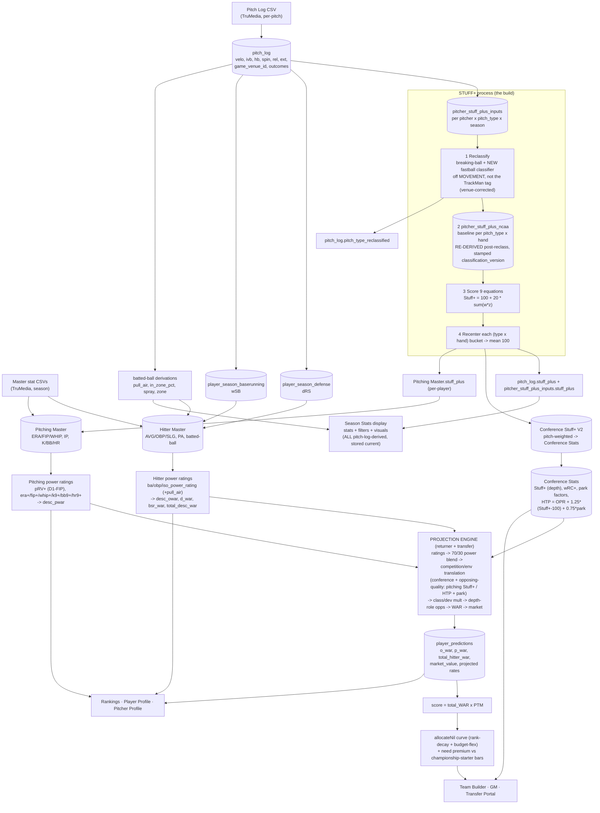

# THE PIPELINE — pitch-log upload → Stuff+ → power ratings → projections → NIL/display (2026-08-17)
> ⛔ **SUPERSEDED IN PART — READ `docs/STUFF_PLUS_SOURCE_OF_TRUTH.md` FIRST (2026-08-29).**
> Stuff+ statements in this file were written before the lanes were untangled and contain WRONG conclusions.
> Corrected facts: (1) the LIVE Stuff+ is the **pitch_log lane** (armHB, self-consistent) — `pitch_log.stuff_plus` →
> `pitch_log_pitcher_totals` → Season Stats/PitcherProfile. (2) `pitcher_stuff_plus_inputs` → `runStuffPlusPipeline` →
> `rollupStuffPlusToMaster` → `"Pitching Master".stuff_plus` is the **LEGACY lane**, not read for 2026 (fallback for
> ≤2025 + JUCO only), and carries a latent raw-HB bug from `e5dec2f`. (3) `breakingBallReclassification.ts` never
> touched `pitch_log` — it is NOT the anchor classifier. (4) v2 is a re-runnable reconstruction for PROD + Track B; it is
> **NOT** an upgrade to staging's existing `pitch_type_reclassified` labels — do not overwrite them. (5) `A5 aggregator
> missing`, `baseline deriver missing`, and `pop/row convention mismatch` claims are FALSE — all verified present/consistent.

The "one process." Today it's **scattered manual scripts**; the goal (Track B) is ONE function that fires on ingest and
runs the whole chain, storing everything. This doc is the map: every stage, what it computes, where it STORES (DB), and
where it DISPLAYS. Companion build plan for the Stuff+ leg: `HANDOFF_STUFF_PLUS_2026_08_16.md`.

## Flow diagram

## ★ KEY CALCULATIONS + PRINCIPLES (Trevor 2026-08-17) — how each aggregate is actually computed
- **The pitch log is the PRIMARY source of truth (highest-frequency), NOT the ONLY source.** The Masters' **power-rating
  INPUTS** — hitter batted-ball + discipline metrics (exit velo, barrel, ev90, pull_air, chase, contact, la, gb, …) AND
  pitcher rate stats — are **pitch-log-derived**, then **married onto the Masters** (they are NOT native Master columns).
  The power ratings (`ba/obp/iso_power_rating`, `pRV+`, `era⁺/fip⁺/whip⁺/…`) and thus `desc_owar/d_war/bsr_war/
  total_desc_war` / `desc_pwar` all flow from pitch-log data. `pull_air / in_zone / spray / zone` = derived-from-pitch-log,
  married on (agreed).
- **★ HITTING/PITCHING MASTER OVERRIDES (Trevor 2026-08-17).** In SOME scenarios a Master-level override supplies values
  the pitch log can't — **baserunning above all, plus some other fields** — uploaded **less frequently than the pitch
  log**. So the re-derive pass is **pitch-log-primary + Master-override-aware**: where an override exists it WINS and the
  pitch-log re-derivation must **NOT clobber it** (same discipline as preserving coach toggles — the "one function" merges,
  never blindly overwrites). Overrides are the exception, not the norm; the pitch log still drives the vast majority.
- **Conference Stuff+ (V2, canonical) =** the **pitch-weighted mean of EVERY pitcher in the conference across the FULL
  season**: `Σ(pitcher Stuff+ × his pitch count) / Σ(pitch count)`. It is the conference's **pitching depth/quality**.
- **Conference HTP =** the same idea for **hitters** — the conference's aggregate hitter talent across ALL its teams,
  full season. `HTP = OPR + 1.25·(Stuff+−100) + 0.75·park` (post wRC+→park swap).
- **Conference stats are CONFERENCE-vs-CONFERENCE only.** The conference is the unit of comparison — the aggregates rank
  conferences against each other (how tough is conf X vs Y). That comparison is exactly what the projection
  competition-translation lever consumes (a player projected INTO conf X faces conf X's Stuff+ / HTP).
- **Projections must FILL the snapshots WITHOUT touching toggles.** The returner/transfer recompute writes
  `player_snapshot` / `transfer_snapshot` **preserving any coach-set toggles** (dev aggressiveness, roster status, class
  transition, cornerstone) — never resets them — and **refreshes ALL displayed metrics to the most current values** (this
  is Step 7c).
- **Savant is DEAD/unused** — clear it after this work (logged to memory). The live surface for pitch-log stats is the
  **Season Stats display**; every stat, filter, and visual there must be pitch-log-derived + stored up-to-date.
- **Park factors = re-evaluate AFTER Stuff+ (quick).** [[project_park_factor_rework]] — next-after-Stuff+, small pass.

## Stage table (compute → store → display)

| # | Stage | Computes | Stores (DB) | Displays |
|---|---|---|---|---|
| 1 | Ingest | — | `pitch_log` (per-pitch); `Hitter Master`/`Pitching Master` (season stats) | — |
| 2 | Derive from pitch_log | Stuff+ inputs, dRS defense, wSB baserunning, pull_air/in_zone/spray/zone (+ all power-rating inputs) | `pitcher_stuff_plus_inputs`, `player_season_defense`, `player_season_baserunning`, **married onto the Masters** | Season Stats display |
| 3 | **Stuff+** (the build) | reclassify → re-derive baseline → 9-eq score → recenter | `pitch_log.stuff_plus` + `.pitch_type_reclassified`, `pitcher_stuff_plus_inputs.stuff_plus`, `pitcher_stuff_plus_ncaa`, `Conference Stuff+ (V2)`, `Pitching Master.stuff_plus` | Season Stats display (Stuff+, pitch mix) |
| 3b | **Season-stats dimension aggregation** (needs 3 done + Hitter Master top-quartile for `vs_top_hitters`) | per-dimension slash line + rates + by-pitch-type across splits: `all, vs_lhp/rhp, vs_92plus, vs_stuff_100/105plus, vs_fastball/breaking/offspeed, vs_top_hitters` (48 aggs / 10 dims) | `pitch_log_hitter_totals`, `pitch_log_pitcher_totals`, `*_by_pitch_type` (keyed `dimension_key`) | **Season Stats display** (`/stats` → `PitchLogSection`). ⚠ currently OFFLINE `scripts/aggregate_pitch_log_dimensions.ts` → Track B must absorb here; `conf_only`/intra-conf split not built. |
| 4 | Power ratings (Masters) | hitter ba/obp/iso ratings (+pull_air) → desc WAR; pitcher pRV+/era⁺/… → desc pWAR | `Hitter Master` + `Pitching Master` (ratings + `desc_*` / `total_desc_war` cols) | Player/Pitcher Profile, Rankings |
| 5 | Conference baselines | Conf Stuff+ (depth), wRC+, park factors, HTP | `Conference Stats` | Team Builder context |
| 5.5 | **Projection calibration (NEW, 2026-08-24)** | per-stat mean + TWO-SIDED SD (`sd_good`/`sd_bad`) on the qualified pop (min IP/AB) + `pr_sd` from stage-4 ratings — fixes the z-shift over-projecting elite (impossible HR9/ERA) | `model_config` (per-stat `*_sd_good`/`*_sd_bad`/`*_ncaa_avg`/`*_qual_min`) | (feeds stage 6) — see `AGENT_LEARNINGS_projection_calibration_two_sided_sd_2026_08_24.md`. NOT built yet. |
| 6 | Projections | returner + transfer engine (blend → competition translation via Stuff+/HTP/park → class/dev → depth-role → WAR → market); **reads stage-5.5 two-sided SDs, directional (sd_good toward elite, sd_bad toward poor)** | `player_predictions` (o_war, p_war, total_hitter_war, market_value, rates) | Rankings, Profiles, Team Builder, Transfer Portal |
| 7 | NIL + need | score = total_WAR × PTM → allocateNil curve + need premium | (computed live; GM `gm_budget.nil_allocation_mode`) | Team Builder, GM, Target Board |

## Current vs target
- **Current:** stages 2–5 (+ **3b**) are **scattered one-off scripts run by hand** (`recompute-stuff-plus`, `compute_pitch_log_stuff_plus`, `conferenceStuffPlusV2`, `populate-conference-stats-env-plus`, `aggregate_pitch_log_dimensions` (3b, season-stats splits), the Master rating stores, the conf-stats Bucket-A/OPR/HTP producers, …) — easy to forget → stale baselines/conference/season-stats values.
- **Target (Track B):** ONE function fires on pitch-log ingest and runs stages 2→3→**3b**→4→5→6 in order, stamped `classification_version` + `constants_version`, re-deriving every downstream aggregate in the same pass (no old-taxonomy means survive). 3b (season-stats splits) runs after Stuff+ (3), independent of projections (6). Stage 1 Master-CSV ingest stays a separate upload; the pipeline marries its pitch-log derivations onto the Masters.
- **Sequencing rule:** Stuff+ (stage 3) must be FINAL before the transfer recompute (stage 6, Step 6b) so projections land once. NIL's `total_hitter_war` + need-premium wiring rides the 6b/7c recompute.

---
## ★ ADD: Season-stats dimension aggregation — a MISSING edge-fn stage (2026-08-21 audit)
The player-facing **Season Stats** display (`/dashboard/player/:id/stats` → `PlayerStatsPage` → savant COMPONENT `PitchLogSection`; pitcher `/dashboard/pitcher/:id/stats`) shows a filtered slash line + rate tables across **dimension splits**: hitter `all, vs_lhp, vs_rhp, vs_92plus, vs_stuff_100plus, vs_stuff_105plus, vs_fastball, vs_breaking_ball, vs_offspeed`; pitcher `all, vs_lhp, vs_rhp, vs_fastball, vs_breaking_ball, vs_offspeed, vs_top_hitters`.
- **These are STORED + read** from `pitch_log_hitter_totals` / `pitch_log_pitcher_totals` (+ `*_by_pitch_type`), keyed by `dimension_key`. Staging: 50,418 / 37,306 rows (2026). No browser aggregation on the Stats tab. ✅
- **BUT the producer is an OFFLINE hand-run script**: `scripts/aggregate_pitch_log_dimensions.ts` (`npm run aggregate-pitch-log-dimensions -- --apply`) — NOT in the edge fn. Dry-run VERIFIED working 2026-08-21 (48 aggregations across 10 dimensions, 967 top-quartile hitter IDs resolved, exit 0). **→ Track B must ABSORB this per-dimension aggregation into the on-upload path** (same "retire the scattered scripts" goal as stages 2–5). Prod: this script must run to fill the totals tables (add to runbook if not already an explicit ordered step — currently only the `.ip` column patch F1 + team_season_stats re-source reference these tables).
- **Hitter descriptive run values (added 2026-08-26):** `scripts/aggregate_pitch_log_dimensions.ts` now calls `select populate_hitter_run_values(2026);` at the END of its run, filling `batting_rv/defensive_rv/baserunning_rv` (+ national `*_z`) on the `dimension_key='all'` rows of `pitch_log_hitter_totals` (batting from the fresh counts, defensive=drs_floor, baserunning=wsb_runs). Displayed as the "VALUE" cluster on the hitter Season Stats banner (pure-read). **→ When Track B absorbs stage 3b, it MUST also call `populate_hitter_run_values(season)` after the hitter aggregation** (needs the fresh `all`-row counts + reads `player_season_defense`/`player_season_baserunning`). `docs/AGENT_LEARNINGS_hitter_run_values_2026_08_26.md`.
- **Live-compute that remains (acceptable):** the **Visuals tab** fine filters (pitch type × zone location × batted-ball) aggregate raw `pitch_log` client-side (`PitchLogSection` `filteredPitches` useMemo). Combinatorial → arguably fine to leave live; NOT a stored-first violation worth precomputing.
- **UNBUILT (planned):** no `conf_only` (`is_conference_game`) dimension, no home/away, no date-range, no per-player intra-conf split storage (`season_stats` is a single slash line, no `*_reg`). If a conference-only toggle is wanted on the season-stats page, the edge fn needs a new `conf_only` `dimension_key` in this aggregation. [[project_conference_stats_scope_rule]]

## ★ SAVANT deletion guardrail (2026-08-21) — pages vs components
Splitting `src/savant/` for the "clear stale savant" cleanup:
- **`src/savant/pages/*`** (SavantHitterPage, SavantPitcherPage, SavantTeamProfile, SavantConferenceStats) = OLD internal pages, reachable ONLY via `/savant/*` (email-allowlist `SavantRoute`, App.tsx:150-167). NOT the coach player-eval workflow. These hold the out-of-date LIVE oWAR/pWAR (TeamProfilePage) + z×20 env+ (ConferenceStatsPage) compute. **SAFE to delete.**
- **`src/savant/components/*` + `hooks/*` + `lib/*`** (esp. `PitchLogSection`) = LOAD-BEARING for the live coach routes (`PlayerStatsPage`/`PitcherStatsPage` `/stats`, plus PlayerProfile/PitcherProfile/ReturningPlayers/GM import savant hooks+lib). **DO NOT delete** — a blanket `rm -rf src/savant` breaks the real season-stats display.
- The active coach player-eval pages are the NON-savant `PlayerProfile` / `PitcherProfile` / `PlayerHub` (App.tsx:119-123). So the "savant is not used" statement is true for savant **pages**, not savant **components**.

## ★★★ THE FORWARD RECLASSIFICATION → STUFF+ PROCESS (FINAL, Trevor-confirmed 2026-08-28). LINEAR + per-pitcher usage-weighted.
This is the committed go-forward for BOTH the prod regen AND Track B on-ingest. NO feedback loop, NO gyro_stuff_plus, NO score-flip (all dropped).
1. **CLASSIFY by the derived RANGES.** `scripts/reclassify_v2.ts`: per-pitch 10-bucket SEED (incl `FBSTRIP` = FA/SI rr∈[−4,4] strip) →
   per-pitcher cluster (merge Δarmhb<4 & Δivb<3.5 & Δvelo<2.5) → label-by-MEAN vs the CORE ranges (per-pitch×hand, handedness-normalized armHB) →
   tiebreakers (CT/SL ride-floor, gyro/curve blend). Output: clear labels + the ~8% seam-unclear flagged. (Stage-1 = 91.5% / 92.0% arsenal-mix.)
2. **TRACK USAGE %.** Per pitcher, from the CLEAR pitches, compute the % of each pitch type he throws → his true arsenal (which pitches, how much).
3. **BACKFILL the unclear ~8%.** Fold each seam-unclear pitch into the pitcher's DOMINANT CLOSE-PROXIMITY pitch — the main pitch he actually
   throws that it sits nearest to in movement → the label matches his real repertoire (a 4S guy's ambiguous fastball → his 4S; a gyro-heavy
   guy's borderline breaker → his gyro). USAGE-WEIGHTED, not just nearest. Reserve `needs_review` ONLY for genuinely distinct RARE pitches (a
   new experimental pitch), NOT seam bleed. (This is what staging did — confirmed via `reclassify_v2.ts --pitcher <id>`.)
4. **RUN THE FULL STUFF+ ONCE.** `src/savant/lib/stuffPlusEngine.ts` scores each pitch by its FINAL label via the pitch-type switch
   (`calcGyroSlider` = the SINGLE gyro eq, line 305) → recenter per (pitch_type×hand).
5. **AGGREGATE over the full season** → per-pitcher TRUE overall Stuff+ + usage %.
Prod = REGENERATE end-to-end (not copy). A2 committed writer stamps the step-3 final labels (keyset/direct-session). Full recovery detail:
`docs/STUFF_PLUS_RECLASS_HANDOFF_2026_08_28.md` + `docs/STUFF_PLUS_V2_CLASSIFIER_DESIGN_RECOVERED.md` (derived ranges §). NEXT BUILD: step 3
(usage-weighted backfill) into reclassify_v2.ts → validate vs `_reclass_result` → wire steps 4-5 (existing engine) → per-pitcher Stuff+ cross-check.

### ★ STEP 3 REFINEMENT (Trevor 2026-08-28) — the proximity gate is the whole game; fold is SEAM-LOCAL + TIGHT, never "nearest anchor"
The usage-weighted backfill applies ONLY to genuinely-borderline pitches. Three cases:
1. **Core pitch** (cluster centroid clearly inside one type's range, FAR from any seam) → KEEP its label; usage is IRRELEVANT. (e.g.
   a −15 IVB cluster is nowhere near the gyro band [−4,+4] → it stays Curve/Sweeper no matter how many gyros the pitcher throws.)
2. **Borderline** (centroid near a SEAM between two adjacent types AND within a TIGHT movement distance of one of those two seam-adjacent
   pitches the pitcher actually throws) → fold to the HIGHER-USAGE of those two. Usage only breaks the tie WHEN MOVEMENT CANNOT.
3. **Distinct but far from all his pitches** → KEEP its own label + `needs_review`. A pitcher can throw 1 of any pitch in the sport; never erase it.
GATE = tight movement distance to a SEAM-ADJACENT dominant pitch — NOT "nearest anchor" (that sloppy version would swallow legit distinct
pitches). Implement as: a cluster is fold-eligible only if it's within the tight seam band of two types AND a dominant same-region anchor exists.

## ★★★★ GO-FORWARD PLAN — COMPACTION-SAFE HANDOFF (2026-08-28). START HERE for the Stuff+ chain + Track B.
### STATE (all committed @ 373830b on feature/war-recalibration)
- **v2 classifier BUILT + validated + committed.** `scripts/reclassify_v2.ts` — 92.6% per-pitch / 93.0% arsenal-mix vs staging
  `_reclass_result` (honest diverse sample). STUFF+ CROSS-CHECK PASSED (`--stuffcheck`): per-pitcher overall Stuff+ |Δ| mean 0.85,
  91% within ±2 → classification difference is product-invisible. Classifier core EXPORTED (classifyPitcher/classifySeed/armHBof/mean).
- **A2 prod writer BUILT + prod DRY-RUN PASSED.** `scripts/reclassify_prod.ts --dry-run` on prod = 2,013,005 labels, needs_review 8.6%,
  distribution matches staging (fastballs/SW/CB/FC/SPL dead-on; SL/GY/CH = the known seam bleed). `--go` (needs PGURI) writes via keyset/direct-session.

### ★ THE FIX REQUIRED (Trevor): v2 REPLACES the OLD v1 breaking-ball reclassification in the pipeline
`scripts/recompute-stuff-plus.ts` STEP 2 currently runs `runBreakingBallReclassification` = the OLD v1 (gyroCap 6/3, no FBSTRIP, no
seam-local backfill) — it would CLOBBER v2. **DROP step 2.** The v2 classifier does the classification at PITCH level; the pipeline must
NOT re-reclassify. v2 labels live in `pitch_log.pitch_type_reclassified` (written by A2). The 3 drifted v1 copies (breakingBallReclassification.ts
reclassifyRHP/LHP, reclassify_pitch_log.ts, _run_reclassify_*) are SUPERSEDED — quarantine (audit A7).

### THE PROCESS (LINEAR — prod regen AND Track B on-ingest). NO v1 reclass, NO gyro_stuff_plus, NO feedback loop.
1. **CLASSIFY** → `reclassify_prod.ts` (v2) stamps pitch_log.pitch_type_reclassified + classification_version + needs_review. [A2, BUILT]
2. **AGGREGATE** → pitch_log (v2 labels) → `pitcher_stuff_plus_inputs` per (pitcher × label × hand): mean velocity/ivb/hb(armHB)/rel_height/
   rel_side/extension/spin + pitch count. [A5 — TO BUILD; map source_player_id=pitcher_id, division from level, whiff_pct from is_whiff;
   fb_ch_velo_diff comes from the veloDiff step]. NO committed producer exists (only add_d2 one-off).
3. **★ NEXT STEP — SCORE per row BY LABEL** → `stuffPlusEngine.ts` `calculateStuffPlus(label, row, pop)` scores each (pitcher × label)
   row by its label's equation (`calcGyroSlider` = the SINGLE gyro eq, line 305) → `stuff_plus`; recenter per (type × hand). Already
   worked through + validated via `reclassify_v2.ts --stuffcheck` (faithful copy of all 9 equations). veloDiff (fb_ch_velo_diff) runs before scoring.
4. **ROLLUP** → Pitching Master.stuff_plus + Conference Stats V2. [rollupStuffPlusToMaster.ts, existing]
5. **AGGREGATE over season** → per-pitcher overall Stuff+ + usage %.

### NEXT STEP (Trevor): the Stuff+ per-row-by-label scoring (steps 2-3) — build A5 aggregator + wire stuffPlusEngine on v2 labels (drop v1).
### PROD EXECUTION (GATED): A2 `--go` needs PGURI + "prod, now?" + audit blockers resolved (landmine committed ✓; ledger drift). Then A5 → score → rollup on prod.
### TRACK B: this exact linear chain is the on-ingest edge fn (`project_unified_projection_edge_function`); the classifier + scoring are the committed forward process.

---
## ★★★ CORRECTED STUFF+ CHAIN (2026-08-29) — USE THIS, NOT THE LEGACY STEPS BELOW/ABOVE
Any Stuff+ step in this document that routes through `pitcher_stuff_plus_inputs` → `runStuffPlusPipeline` →
`rollupStuffPlusToMaster` → `"Pitching Master".stuff_plus` is the **LEGACY lane** and is WRONG for 2026. Running it
revives the latent raw-HB bug (e5dec2f removed `hbSign`; PSP-I still stores RAW hb ⇒ left-handers scored backwards)
and writes numbers nothing displays. **Do not run those steps.**

**THE CORRECT ORDER (pitch_log lane — the live source of truth):**
1. **Reclassify** → `pitch_log.pitch_type_reclassified` + `classification_version` + `needs_review`
   `scripts/reclassify_prod.ts` (v2 classifier; `--dry-run` first, then `--go` with PGURI + explicit "prod, now?")
2. **Re-derive the pop baseline** → `pitcher_stuff_plus_ncaa` (per pitch_type × hand, **armHB**, D1-only)
3. **Score per pitch** → `pitch_log.stuff_plus`  — `scripts/compute_pitch_log_stuff_plus.ts`
   (normalizes hb→armHB itself; recenters each (pitch_type × hand) bucket to mean 100)
4. **Aggregate** → `pitch_log_pitcher_totals` / `pitch_log_hitter_totals` / `*_by_pitch_type`
   `scripts/aggregate_pitch_log_dimensions.ts --apply` (also calls `populate_hitter_run_values(season)`)
5. **Marry onto the Masters** → `scripts/derive_masters_from_pitchlog.ts --apply`
   (⚠ add `.order(PK)` to its `readAll` pagination first — unordered `.range()` over ~2.5M rows silently drops/dupes)
6. Then continue the runbook: C23–C29 → Phase D (dWAR) → E (precomputes) → F (re-bakes) → G (edge fn) → H (drops).

**INVARIANTS**
- ⚠ A label change invalidates every downstream number. Steps 1→5 must complete in the SAME working session;
  never leave prod with new labels and old `stuff_plus`.
- `hb` is stored RAW everywhere and displayed raw. armHB is a COMPUTE convention only — normalize in memory.
  NEVER rewrite the stored `hb` column.
- One consistent label vocabulary: `4S FB` (not `4-Seam Fastball`) + a `classification_version` stamp on every row.
- Full detail + evidence: `docs/STUFF_PLUS_SOURCE_OF_TRUTH.md`.

---
## ★★★ STUFF+ v2 CLASSIFIER — CURRENT STATE + CONCLUSIONS (2026-08-29). Numbers: `docs/STUFF_PLUS_EXACT_VALUES.md` §11.
**ACCURACY vs the anchor ground truth (`_reclass_result`, all 4,804 pitchers / 2,000,674 pitches):**
`1,885,862 / 2,000,674 = 94.3% per-pitch` · arsenal-mix 94.3% · needs_review 8.1% — **+ the §4.5 gyro fix (measured
+0.96pp / +1.24pp on two disjoint samples) → projected ~95.3-95.4%.** Supersedes the stale 92.6%, which predated the
fixes AND was measured against a DUPLICATE copy of the classifier that has since been deleted.

**THREE FIXES SHIPPED (all measured, none guessed):**
1. **Offspeed armHB floor** `armhb > 0` → **`armhb >= 5`**. Gyro armHB p99=4.7 vs offspeed p1=5.3 — a clean empty gap.
   Killed `Gyro→Change-up` (338 losses) and `Cutter→Change-up` (29) outright.
2. **Fastball-family MERGE GUARD** — never merge clusters whose fastball-family seeds (`4S FB`/`Sinker`/`FBSTRIP`)
   differ. Merge was swallowing the FBSTRIP cluster before it could be resolved; **>60% of all 4S↔Sinker errors** were
   merged FBSTRIP clusters. 91.69% → 93.01%; 4S↔Sinker errors 2,830 → 1,676 (−41%). Also preserves genuine
   two-fastball arms (14ivb/8hb vs 8ivb/14hb at equal velo stay SEPARATE; 14/8 vs 13/9 correctly merge).
3. **§4.5 gyro/slider cluster-centroid floor** `GYRO_ARMHB_FLOOR = -3`, applied BEFORE `tiebreak()` (ordering is worth
   ~+0.3pp). `Gyro→Slider` 1,675→471 / 1,788→508; `Gyro→Cutter` 415→131 / 437→56; zero fastball/offspeed regression.

**TWO NEGATIVE RESULTS — do NOT redo these:**
- `rr > -1.7` FBSTRIP cut (made agreement WORSE: disputes 1,443 → 2,503; it was fit on a merge-corrupted population).
  `rr >= 0` stays — within noise of the 91.9% @ rr=-0.13 optimum.
- The **"arsenal rule"** (flip Slider→Gyro when the pitcher has a GY seed and no SW seed) is a **CONFOUND**, not a rule:
  sweeper-presence predicts the anchor 71.5% vs 89.1% for the cluster's own mean armHB. Implemented literally it
  **LOSES 0.97/1.26pp**. Do not rebuild it from the `_reclass_map` contingency table.
**VERIFIED ALREADY-OPTIMAL (do not touch):** Sweeper/Slider armHB −12 (1.0% error) · Gyro/Slider armHB −5.

**⚠ AGREEMENT WITH THE ANCHOR IS NOT ACCURACY.** The anchor is the PREVIOUS classifier's output (a lost scratchpad
implementation), not truth. The residual ~4.7% mixes (a) v2 wrong, (b) **v2 RIGHT and the anchor wrong**, (c) coin-flips.
Partition it with `scripts/v2_coherence_test.ts` before treating any of it as error. If v2 wins a meaningful share, the
"do NOT overwrite staging's labels" guidance REVERSES.

**⚠ DOWNSTREAM — NOT display-only.** The gyro fix moves **6-8% of ALL breaking-ball volume** Slider→Gyro Slider. Every
mix-dependent artifact MUST be regenerated after a reclass run: `pitcher_stuff_plus_ncaa` baselines, D1/regional means
+ SDs, pitch-shape percentiles. Reclassify → baseline → score → aggregate MUST complete in ONE session.

**PROD STATUS:** prod pitch_log is on the OLD per-pitch CASE labels (`"4-Seam Fastball"` naming, ~2,176,888 rows, NO
`classification_version` stamp, `needs_review` all null, no `_reclass_fix` table) — **v2 has NEVER written to prod**; the
prior prod work was a read-only dry run. v2 vs prod's existing labels = **70.9% agreement (v2 would change 584,130
pitches = 29.1%)**, and v2 is far closer to the validated set (distribution deviation from anchor **38.7 → 21.6**),
correcting prod's Cutter 10.3%→3.7% (anchor 2.4%) and Splitter 0.7%→2.1% (anchor 2.2%). Prod run is GATED on PGURI +
an explicit "prod, now?" and MUST be followed immediately by the Stuff+ recompute chain.

---
## ★★★ TRACK B — STUFF+ STAGE, LOCKED SPEC (2026-08-29). Supersedes any earlier Stuff+ description here.
Track B = ONE function on pitch-log ingest (weekly/biweekly, local folder watch). Master-sheet uploads come LATER as a
CHECK + to override only what pitch_log cannot produce (e.g. AVG/SB). **pitch_log is the SOURCE OF TRUTH.**

**THE STUFF+ STAGE — exact order. Steps 1→5 MUST complete in ONE run; a label change invalidates every number below it.**
1. **CLASSIFY** → `pitch_log.pitch_type_reclassified` + `classification_version` + `needs_review`
   `src/savant/lib/stuffPlusClassifierV2.ts` (v2 — the SINGLE classifier), driven by `scripts/reclassify_prod.ts`.
2. **RE-DERIVE the pop baseline** → `pitcher_stuff_plus_ncaa` (per pitch_type × hand, **armHB**, D1-only).
   ⚠ MANDATORY, not optional: the §4.5 gyro fix moves **6-8% of ALL breaking-ball volume** Slider→Gyro Slider, so every
   mix-dependent artifact (baselines, D1/regional means + SDs, pitch-shape percentiles) is invalid until regenerated.
3. **SCORE per pitch** → `pitch_log.stuff_plus` — `scripts/compute_pitch_log_stuff_plus.ts`
   (normalizes hb→armHB itself; recenters each (pitch_type × hand) bucket to mean 100).
4. **AGGREGATE** → `pitch_log_pitcher_totals` / `pitch_log_hitter_totals` / `*_by_pitch_type`
   `scripts/aggregate_pitch_log_dimensions.ts` (must also call `populate_hitter_run_values(season)`).
5. **MARRY ONTO THE MASTERS** → `scripts/derive_masters_from_pitchlog.ts`
   (⚠ add `.order(PK)` to its `readAll` first — unordered `.range()` over ~2.5M rows silently drops/dupes).
Then: power ratings → conference baselines → projections → market/NIL.

**⛔ WHAT TRACK B MUST NEVER DO**
- NEVER route Stuff+ through the LEGACY lane: `pitcher_stuff_plus_inputs` → `runStuffPlusPipeline` →
  `legacy_rollupStuffPlusToMaster` → `"Pitching Master".stuff_plus`. Nothing reads it for 2026 and it carries the latent
  raw-HB bug (e5dec2f removed `hbSign`; PSP-I stores RAW hb ⇒ left-handers scored BACKWARDS).
- NEVER call `legacy_breakingBallReclassification` (v1). It writes `rstr_pitch_class` on PSP-I, has never touched
  pitch_log, and is NOT the anchor classifier. Conflating the two cost a full day (2026-08-28/29).
- NEVER rewrite the stored `hb` column to armHB. `hb` is RAW by design (UI displays it; the CSV importer writes it raw).
  armHB is a COMPUTE convention — normalize in memory only.
- NEVER leave new labels with stale scores. Steps 1→5 are one transaction-of-work.

**LANE COVERAGE (measured):** `pitch_log` is **D1-only** — 5,303 pitchers. PSP-I covers 7,012; the 1,709 difference is
**1,627 NJCAA_D1 + 81 D1 + 1 D2**. → **JUCO has no pitch logs and stays CSV-derived** (scored vs D1 baselines). Track B's
pitch_log chain covers D1 only; do not let it silently drop JUCO. JUCO process is being restarted separately.

**CLASSIFIER STATE FEEDING TRACK B (2026-08-29):** v2 = **94.3% per-pitch** on the full 2,000,674-pitch anchor set
(arsenal-mix 94.3%, needs_review 8.1%), **→ projected ~95.3-95.4%** with the §4.5 gyro floor. Three shipped fixes:
offspeed `armHB >= 5` floor · fastball-family MERGE GUARD (>60% of 4S↔Sinker errors) · §4.5 gyro cluster floor `-3`
applied BEFORE `tiebreak()`. Two logged NEGATIVE results — `rr > -1.7` and the "arsenal rule" confound (loses ~1pp) —
do NOT rebuild either. Full numbers: `docs/STUFF_PLUS_EXACT_VALUES.md` §11. Lane map: `docs/STUFF_PLUS_SOURCE_OF_TRUTH.md`.

**⚠ AGREEMENT WITH THE ANCHOR IS NOT ACCURACY.** The anchor is the previous classifier's output, not truth. The residual
~4.7% mixes v2-wrong / **v2-RIGHT-anchor-wrong** / coin-flips — partition with `scripts/v2_coherence_test.ts` before
treating it as error, and before deciding whether staging's labels should be updated rather than preserved.

---
# 🔴 STEP 4 (aggregate_pitch_log_dimensions) — GATEWAY TIMEOUT ON `vs_top_hitters`. Found on staging 2026-08-29/30.
**EVERY aggregation in this script runs through `exec_sql` over the HTTP gateway** (`aggregate_pitch_log_dimensions.ts:1035`
`await supabase.rpc("exec_sql", { sql })`). The gateway cuts the client at ~125s and the work is LOST.

## The deterministic failure
`[40/48] vs_top_hitters → pitcher_totals — FAILED after 125.3s: upstream request timeout`
**Reproduced EXACTLY twice** — same dimension, same error, same 125.3s duration. Not a dropped connection: that query
must resolve the top-quartile hitter set (~967 IDs) and filter ~2M pitches against it, which exceeds the gateway ceiling.
47 of 48 aggregations complete fine (~60-72s each); only this one is structurally too heavy for `exec_sql`.
⚠ **The script HALTS on the failure**, so dimensions 41-48 never ran either — one bad dimension blocks 9.

## WORKAROUND USED ON STAGING (Trevor's call)
1. `--skip=vs_top_hitters` to clear the other 47 (the `--skip` flag exists at `:953-954`, matched at `:1029`).
2. Run `vs_top_hitters` SEPARATELY over the **direct pg session** (`PGURI`) where there is no gateway timeout —
   the same pattern the reclassifier already uses for its big writes.

## ⚠⚠ PROD IMPLICATION — THIS WILL BE WORSE ON PROD, PLAN FOR IT
Prod is on a smaller compute tier with a more throttled disk, and prod's `exec_sql` has ALREADY been observed timing
out on far lighter queries. Do NOT assume the other 47 will clear on prod just because they did on staging.
**Recommended prod approach: run stage 4 over the direct pg session from the start**, not through `exec_sql`.
Budget generously and run it detached/unattended-safe.

## SEPARATE, ENVIRONMENTAL FAILURES SEEN THE SAME NIGHT (do not confuse with the above)
Three earlier failures were the LOCAL MACHINE sleeping / dropping its connection overnight, NOT script defects:
- staging insert during the v2 test: `TypeError: fetch failed`
- STEP 3 scoring died at 1,665,000/2,015,321 (~83%): `read ECONNRESET`
- STEP 4 first run died at 13/48, second reached 39/48
**Symptom that distinguishes them:** environmental failures die at DIFFERENT points each run; the `vs_top_hitters`
failure dies at the SAME dimension with the SAME duration every time.
✅ **PROVEN PROCESS (Trevor): run long steps DETACHED in the background and let them take however long they need,**
with `caffeinate -dimsu -w <pid>` tied to the process so the machine cannot sleep mid-run. Do not babysit, do not
add aggressive retry loops.
⚠ STEP 3 (`compute_pitch_log_stuff_plus.ts`) is idempotent but does **NOT** resume — `:185` re-scores ALL rows matching
the class version rather than filtering `stuff_plus IS NULL`, so every attempt costs the FULL runtime (~36 min on
staging). A mid-run failure leaves **v2 labels + STALE scores**, the one state every doc says must never exist.
