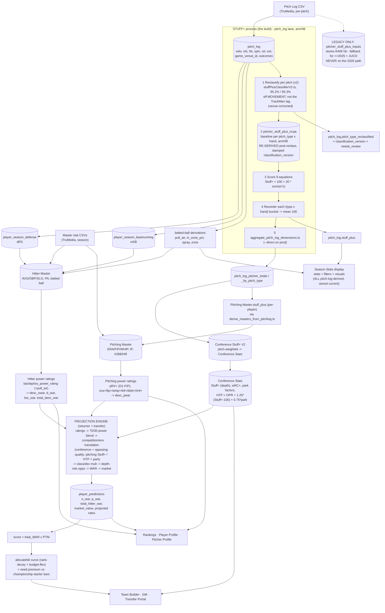

# THE PIPELINE — pitch-log upload → Stuff+ → power ratings → projections → NIL/display (2026-08-17)
> ## ★ CURRENT STATE — READ FIRST (2026-08-30). This supersedes every older statement in this file.
> - **LANE (TOP DOG):** the only correct Stuff+ lane is the **pitch_log lane** —
>   `pitch_log.pitch_type_reclassified` → `compute_pitch_log_stuff_plus.ts` → `pitch_log.stuff_plus` →
>   `aggregate_pitch_log_dimensions.ts` → `pitch_log_pitcher_totals` / `_by_pitch_type` → Season Stats + PitcherProfile.
>   **armHB throughout, self-consistent, CORRECT.**
> - **LEGACY LANE (≤2025 + JUCO ONLY, NEVER 2026):** `pitcher_stuff_plus_inputs` → `runStuffPlusPipeline` →
>   `legacy_rollupStuffPlusToMaster` → `"Pitching Master".stuff_plus`. It stores RAW hb, and since commit `e5dec2f` the
>   shared equations expect armHB — so running it scores **LEFT-HANDERS BACKWARDS**. Not live, not on main. Every step in
>   this document has been rewritten onto the pitch_log lane; if you find one that still routes through the legacy lane,
>   it is WRONG. (`legacy_breakingBallReclassification.ts`, renamed from `breakingBallReclassification.ts`, never touched
>   `pitch_log` and is NOT the anchor classifier.)
> - **CLASSIFIER:** `src/savant/lib/stuffPlusClassifierV2.ts` is the SINGLE source (`scripts/reclassify_v2.ts` is only a
>   validation harness; its duplicate copy was deleted). **FINAL ACCURACY = 95.2% per-pitch / 95.3% arsenal-mix /
>   needs_review 8.1%** on the full 2,000,674-pitch population. ⚠ SUPERSEDED — never quote as current: **92.6%, 94.3%,
>   95.1%, "~85%", and any "projected ~95.3-95.4%"**.
> - **DECISION (Trevor, FINAL):** standardize on v2 in **BOTH** environments — **DO overwrite staging's labels.** Any
>   "do NOT overwrite staging's labels" guidance anywhere is REVERSED and obsolete.
> - **STAGING:** the v2 chain is RUN + VERIFIED — backup `_v2_prechain_backup` (2,579,655 rows, DO NOT DROP) ·
>   2,015,321 classified/stamped `v2-ranges-2026-08-28` (needs_review 8.1%) · `_reclass_pf` materialized (5,364
>   pitchers) · baseline armHB SIGN CHECK PASSED 18/18 · 2,015,321 scored + recentered (every type×hand bucket exactly
>   100.0) · step 4 all 48 dimensions + `populate_hitter_run_values`. **Still open on staging:** step 5
>   `derive_masters_from_pitchlog.ts` is DRY-RUN ONLY (0 hitters / 4,675 pitchers would change; never applied on ANY env).
> - **PROD:** still on the OLD per-pitch CASE labels (`"4-Seam Fastball"`, ~2,176,888 labeled of ~2,575,996, no
>   `classification_version`, `needs_review` all null). **v2 has NEVER written to prod.** Prod's DATA is ready (100.00% of
>   `is_data=true` rows are v2-classifiable; venue corrections present and resolving).
> - **⛔ THE ONE REMAINING PROD BLOCKER:** prod's `pitch_log_corrected` VIEW is `select pl.*` **FROZEN at 94 of 99
>   columns** and is MISSING `classification_version`, so the scorer hard-fails there. Fix =
>   `drop view pitch_log_corrected cascade; create view …`. **DDL — requires its own explicit go**, separate from the
>   data-write "prod, now?".
> - **▶ NEXT ACTION:** rebuild that view on prod, then run the prod Stuff+ chain (reclassify → baseline → score →
>   aggregate **with `--direct`** → Masters) in ONE 4-6 h sitting, machine pinned awake.

The "one process." Today it's **scattered manual scripts**; the goal (Track B) is ONE function that fires on ingest and
runs the whole chain, storing everything. This doc is the map: every stage, what it computes, where it STORES (DB), and
where it DISPLAYS. Companion build plan for the Stuff+ leg: `HANDOFF_STUFF_PLUS_2026_08_16.md`.

## Flow diagram



## ★ KEY CALCULATIONS + PRINCIPLES (Trevor 2026-08-17) — how each aggregate is actually computed
- **The pitch log is the PRIMARY source of truth (highest-frequency), NOT the ONLY source.** The Masters' **power-rating
  INPUTS** — hitter batted-ball + discipline metrics (exit velo, barrel, ev90, pull_air, chase, contact, la, gb, …) AND
  pitcher rate stats — are **pitch-log-derived**, then **married onto the Masters** (they are NOT native Master columns).
  The power ratings (`ba/obp/iso_power_rating`, `pRV+`, `era⁺/fip⁺/whip⁺/…`) and thus `desc_owar/d_war/bsr_war/
  total_desc_war` / `desc_pwar` all flow from pitch-log data. `pull_air / in_zone / spray / zone` = derived-from-pitch-log,
  married on (agreed).
- **★ HITTING/PITCHING MASTER OVERRIDES (Trevor 2026-08-17).** In SOME scenarios a Master-level override supplies values
  the pitch log can't — **baserunning above all, plus some other fields** — uploaded **less frequently than the pitch
  log**. So the re-derive pass is **pitch-log-primary + Master-override-aware**: where an override exists it WINS and the
  pitch-log re-derivation must **NOT clobber it** (same discipline as preserving coach toggles — the "one function" merges,
  never blindly overwrites). Overrides are the exception, not the norm; the pitch log still drives the vast majority.
- **Conference Stuff+ (V2, canonical) =** the **pitch-weighted mean of EVERY pitcher in the conference across the FULL
  season**: `Σ(pitcher Stuff+ × his pitch count) / Σ(pitch count)`. It is the conference's **pitching depth/quality**.
- **Conference HTP =** the same idea for **hitters** — the conference's aggregate hitter talent across ALL its teams,
  full season. `HTP = OPR + 1.25·(Stuff+−100) + 0.75·park` (post wRC+→park swap).
- **Conference stats are CONFERENCE-vs-CONFERENCE only.** The conference is the unit of comparison — the aggregates rank
  conferences against each other (how tough is conf X vs Y). That comparison is exactly what the projection
  competition-translation lever consumes (a player projected INTO conf X faces conf X's Stuff+ / HTP).
- **Projections must FILL the snapshots WITHOUT touching toggles.** The returner/transfer recompute writes
  `player_snapshot` / `transfer_snapshot` **preserving any coach-set toggles** (dev aggressiveness, roster status, class
  transition, cornerstone) — never resets them — and **refreshes ALL displayed metrics to the most current values** (this
  is Step 7c).
- **Savant is DEAD/unused** — clear it after this work (logged to memory). The live surface for pitch-log stats is the
  **Season Stats display**; every stat, filter, and visual there must be pitch-log-derived + stored up-to-date.
- **Park factors = re-evaluate AFTER Stuff+ (quick).** [[project_park_factor_rework]] — next-after-Stuff+, small pass.

## Stage table (compute → store → display)

| # | Stage | Computes | Stores (DB) | Displays |
|---|---|---|---|---|
| 1 | Ingest | — | `pitch_log` (per-pitch); `Hitter Master`/`Pitching Master` (season stats) | — |
| 2 | Derive from pitch_log | dRS defense, wSB baserunning, pull_air/in_zone/spray/zone (+ all power-rating inputs) | `player_season_defense`, `player_season_baserunning`, **married onto the Masters**. ⛔ NOT `pitcher_stuff_plus_inputs` — that is the LEGACY lane (≤2025 + JUCO only) | Season Stats display |
| 3 | **Stuff+** (the build, pitch_log lane) | reclassify (v2) → re-derive baseline → 9-eq score → recenter → aggregate → marry onto Masters | `pitch_log.pitch_type_reclassified` + `.classification_version` + `.needs_review`, `pitch_log.stuff_plus`, `pitcher_stuff_plus_ncaa`, `pitch_log_pitcher_totals`/`_by_pitch_type`, `Conference Stuff+ (V2)`, `Pitching Master.stuff_plus`. ⛔ never `pitcher_stuff_plus_inputs.stuff_plus` for 2026 | Season Stats display (Stuff+, pitch mix) |
| 3b | **Season-stats dimension aggregation** (needs 3 done + Hitter Master top-quartile for `vs_top_hitters`) | per-dimension slash line + rates + by-pitch-type across splits: `all, vs_lhp/rhp, vs_92plus, vs_stuff_100/105plus, vs_fastball/breaking/offspeed, vs_top_hitters` (48 aggs / 10 dims) | `pitch_log_hitter_totals`, `pitch_log_pitcher_totals`, `*_by_pitch_type` (keyed `dimension_key`) | **Season Stats display** (`/stats` → `PitchLogSection`). ⚠ still an OFFLINE hand-run script (`scripts/aggregate_pitch_log_dimensions.ts`, now with `--prod`/`--direct`/`--only=`) → Track B must absorb it; `conf_only`/intra-conf split not built. 🛑 on PROD run it with `--direct`. |
| 4 | Power ratings (Masters) | hitter ba/obp/iso ratings (+pull_air) → desc WAR; pitcher pRV+/era⁺/… → desc pWAR | `Hitter Master` + `Pitching Master` (ratings + `desc_*` / `total_desc_war` cols) | Player/Pitcher Profile, Rankings |
| 5 | Conference baselines | Conf Stuff+ (depth), wRC+, park factors, HTP | `Conference Stats` | Team Builder context |
| 5.5 | **Projection calibration (NEW, 2026-08-24)** | per-stat mean + TWO-SIDED SD (`sd_good`/`sd_bad`) on the qualified pop (min IP/AB) + `pr_sd` from stage-4 ratings — fixes the z-shift over-projecting elite (impossible HR9/ERA) | `model_config` (per-stat `*_sd_good`/`*_sd_bad`/`*_ncaa_avg`/`*_qual_min`) | (feeds stage 6) — see `AGENT_LEARNINGS_projection_calibration_two_sided_sd_2026_08_24.md`. NOT built yet. |
| 6 | Projections | returner + transfer engine (blend → competition translation via Stuff+/HTP/park → class/dev → depth-role → WAR → market); **reads stage-5.5 two-sided SDs, directional (sd_good toward elite, sd_bad toward poor)** | `player_predictions` (o_war, p_war, total_hitter_war, market_value, rates) | Rankings, Profiles, Team Builder, Transfer Portal |
| 7 | NIL + need | score = total_WAR × PTM → allocateNil curve + need premium | (computed live; GM `gm_budget.nil_allocation_mode`) | Team Builder, GM, Target Board |

## Current vs target
- **Current:** stages 2–5 (+ **3b**) are **scattered one-off scripts run by hand** (`reclassify_prod`, `compute_pitch_log_stuff_plus`, `derive_masters_from_pitchlog`, `conferenceStuffPlusV2`, `populate-conference-stats-env-plus`, `aggregate_pitch_log_dimensions` (3b, season-stats splits), the Master rating stores, the conf-stats Bucket-A/OPR/HTP producers, …) — easy to forget → stale baselines/conference/season-stats values.
- **Target (Track B):** ONE function fires on pitch-log ingest and runs stages 2→3→**3b**→4→5→6 in order, stamped `classification_version` + `constants_version`, re-deriving every downstream aggregate in the same pass (no old-taxonomy means survive). 3b (season-stats splits) runs after Stuff+ (3), independent of projections (6). Stage 1 Master-CSV ingest stays a separate upload; the pipeline marries its pitch-log derivations onto the Masters.
- **Sequencing rule:** Stuff+ (stage 3) must be FINAL before the transfer recompute (stage 6, Step 6b) so projections land once. NIL's `total_hitter_war` + need-premium wiring rides the 6b/7c recompute.

---
## ★ ADD: Season-stats dimension aggregation — a MISSING edge-fn stage (2026-08-21 audit)
The player-facing **Season Stats** display (`/dashboard/player/:id/stats` → `PlayerStatsPage` → savant COMPONENT `PitchLogSection`; pitcher `/dashboard/pitcher/:id/stats`) shows a filtered slash line + rate tables across **dimension splits**: hitter `all, vs_lhp, vs_rhp, vs_92plus, vs_stuff_100plus, vs_stuff_105plus, vs_fastball, vs_breaking_ball, vs_offspeed`; pitcher `all, vs_lhp, vs_rhp, vs_fastball, vs_breaking_ball, vs_offspeed, vs_top_hitters`.
- **These are STORED + read** from `pitch_log_hitter_totals` / `pitch_log_pitcher_totals` (+ `*_by_pitch_type`), keyed by `dimension_key`. Staging: 50,418 / 37,306 rows (2026). No browser aggregation on the Stats tab. ✅
- **BUT the producer is an OFFLINE hand-run script**: `scripts/aggregate_pitch_log_dimensions.ts` (`npm run aggregate-pitch-log-dimensions -- --apply`) — NOT in the edge fn. Dry-run VERIFIED working 2026-08-21 (48 aggregations across 10 dimensions, 967 top-quartile hitter IDs resolved, exit 0). **→ Track B must ABSORB this per-dimension aggregation into the on-upload path** (same "retire the scattered scripts" goal as stages 2–5). Prod: this script must run to fill the totals tables (add to runbook if not already an explicit ordered step — currently only the `.ip` column patch F1 + team_season_stats re-source reference these tables).
- **Hitter descriptive run values (added 2026-08-26):** `scripts/aggregate_pitch_log_dimensions.ts` now calls `select populate_hitter_run_values(2026);` at the END of its run, filling `batting_rv/defensive_rv/baserunning_rv` (+ national `*_z`) on the `dimension_key='all'` rows of `pitch_log_hitter_totals` (batting from the fresh counts, defensive=drs_floor, baserunning=wsb_runs). Displayed as the "VALUE" cluster on the hitter Season Stats banner (pure-read). **→ When Track B absorbs stage 3b, it MUST also call `populate_hitter_run_values(season)` after the hitter aggregation** (needs the fresh `all`-row counts + reads `player_season_defense`/`player_season_baserunning`). `docs/AGENT_LEARNINGS_hitter_run_values_2026_08_26.md`.
- **Live-compute that remains (acceptable):** the **Visuals tab** fine filters (pitch type × zone location × batted-ball) aggregate raw `pitch_log` client-side (`PitchLogSection` `filteredPitches` useMemo). Combinatorial → arguably fine to leave live; NOT a stored-first violation worth precomputing.
- **UNBUILT (planned):** no `conf_only` (`is_conference_game`) dimension, no home/away, no date-range, no per-player intra-conf split storage (`season_stats` is a single slash line, no `*_reg`). If a conference-only toggle is wanted on the season-stats page, the edge fn needs a new `conf_only` `dimension_key` in this aggregation. [[project_conference_stats_scope_rule]]

## ★ SAVANT deletion guardrail (2026-08-21) — pages vs components
Splitting `src/savant/` for the "clear stale savant" cleanup:
- **`src/savant/pages/*`** (SavantHitterPage, SavantPitcherPage, SavantTeamProfile, SavantConferenceStats) = OLD internal pages, reachable ONLY via `/savant/*` (email-allowlist `SavantRoute`, App.tsx:150-167). NOT the coach player-eval workflow. These hold the out-of-date LIVE oWAR/pWAR (TeamProfilePage) + z×20 env+ (ConferenceStatsPage) compute. **SAFE to delete.**
- **`src/savant/components/*` + `hooks/*` + `lib/*`** (esp. `PitchLogSection`) = LOAD-BEARING for the live coach routes (`PlayerStatsPage`/`PitcherStatsPage` `/stats`, plus PlayerProfile/PitcherProfile/ReturningPlayers/GM import savant hooks+lib). **DO NOT delete** — a blanket `rm -rf src/savant` breaks the real season-stats display.
- The active coach player-eval pages are the NON-savant `PlayerProfile` / `PitcherProfile` / `PlayerHub` (App.tsx:119-123). So the "savant is not used" statement is true for savant **pages**, not savant **components**.

## ★★★ THE FORWARD RECLASSIFICATION → STUFF+ PROCESS (FINAL). LINEAR + per-pitcher usage-weighted.
This is the committed go-forward for BOTH the prod regen AND Track B on-ingest. NO feedback loop, NO `gyro_stuff_plus`,
NO score-flip (all dropped). The classifier is `src/savant/lib/stuffPlusClassifierV2.ts` — the SINGLE source, driven by
`scripts/reclassify_prod.ts`; `scripts/reclassify_v2.ts` is a VALIDATION HARNESS only (its duplicate copy was deleted).
1. **CLASSIFY by the derived RANGES.** Per-pitch 10-bucket SEED (incl. `FBSTRIP` = FA/SI rr∈[−4,4] strip) → per-pitcher
   cluster (merge Δarmhb<4 & Δivb<3.5 & Δvelo<2.5, **with the fastball-family MERGE GUARD**) → label-by-MEAN vs the CORE
   ranges (per pitch × hand, handedness-normalized armHB) → §4.5 gyro cluster-centroid floor (`GYRO_ARMHB_FLOOR = -3`)
   → seam-local usage backfill → tiebreakers (CT/SL ride-floor, gyro/curve blend). ⚠ **ORDERING IS LOAD-BEARING:** §4.5
   runs BEFORE the step-4 backfill (and therefore before `tiebreak()`).
2. **TRACK USAGE %.** Per pitcher, from the CLEAR pitches, compute the % of each pitch type he throws → his true arsenal.
3. **BACKFILL the seam-unclear.** Fold each seam-unclear cluster into the pitcher's DOMINANT CLOSE-PROXIMITY pitch —
   USAGE-WEIGHTED, not just nearest. Reserve `needs_review` ONLY for genuinely distinct RARE pitches, NOT seam bleed.
4. **RUN THE FULL STUFF+ ONCE.** `src/savant/lib/stuffPlusEngine.ts` scores each pitch by its FINAL label via the
   pitch-type switch (`calcGyroSlider` = the SINGLE gyro eq) → recenter per (pitch_type × hand) to mean 100.
5. **AGGREGATE over the full season** → per-pitcher TRUE overall Stuff+ + usage %.
**FINAL MEASURED ACCURACY: 95.2% per-pitch / 95.3% arsenal-mix / needs_review 8.1%** on the full 2,000,674-pitch
population. (The stage-by-stage session numbers — 85.2% → 91.5% → 92.6% → 94.3% → 95.1% — are HISTORICAL only.)
Prod = REGENERATE end-to-end (never copy). Full numbers: `docs/STUFF_PLUS_EXACT_VALUES.md` §11.

### ★ STEP 3 REFINEMENT (Trevor) — the proximity gate is the whole game; fold is SEAM-LOCAL + TIGHT, never "nearest anchor"
The usage-weighted backfill applies ONLY to genuinely-borderline pitches. Three cases:
1. **Core pitch** (cluster centroid clearly inside one type's range, FAR from any seam) → KEEP its label; usage is
   IRRELEVANT. (e.g. a −15 IVB cluster is nowhere near the gyro band → it stays Curve/Sweeper no matter the arsenal.)
2. **Borderline** (centroid near a SEAM between two adjacent types AND within a TIGHT movement distance of one of those
   two seam-adjacent pitches the pitcher actually throws) → fold to the HIGHER-USAGE of those two. Usage only breaks the
   tie WHEN MOVEMENT CANNOT. Gate: `moveDist < 5 AND |Δvelo| < 3`, folding only into a strictly-larger anchor.
3. **Distinct but far from all his pitches** → KEEP its own label + `needs_review`. A pitcher can throw 1 of any pitch
   in the sport; never erase it.
GATE = tight movement distance to a SEAM-ADJACENT dominant pitch — NOT "nearest anchor" (that sloppy version would
swallow legit distinct pitches).

## ★★★★ THE CHAIN AS SHIPPED — what is BUILT, and the one thing that is not
- ✅ **v2 classifier BUILT + validated + committed** — `src/savant/lib/stuffPlusClassifierV2.ts`, **95.2% / 95.3%**.
  Stuff+ cross-check PASSED: per-pitcher overall Stuff+ |Δ| mean 0.85, 91% within ±2 → the classification difference is
  product-invisible.
- ✅ **Prod/staging WRITER BUILT + prod DRY-RUN PASSED** — `scripts/reclassify_prod.ts` (`--dry-run` on prod =
  2,013,005 labels; distribution matches staging). `--go` (needs PGURI + "prod, now?") writes via keyset/direct session.
  It also materializes `_reclass_pf`.
- ✅ **v2 REPLACES v1 in the pipeline.** `scripts/recompute-stuff-plus.ts` ran `runBreakingBallReclassification` (the OLD
  v1: gyroCap 6/3, no FBSTRIP, no seam-local backfill) and would CLOBBER v2 — **so the whole legacy orchestrator is out
  of the 2026 path**, and the legacy lane is gated out of `npm run import:prod` (the npm `recompute-stuff*:prod`
  scripts were DELETED). v2 labels live in `pitch_log.pitch_type_reclassified`.
- ⛔ **There is NO "A5 aggregate into `pitcher_stuff_plus_inputs`" step.** That was a FALSE requirement: PSP-I is the
  LEGACY lane and the live chain never goes through it. Scoring happens **per pitch** in
  `compute_pitch_log_stuff_plus.ts`, and the rollup to `Pitching Master.stuff_plus` happens via
  `derive_masters_from_pitchlog.ts` — **never `legacy_rollupStuffPlusToMaster`**.
- ⛔ **NOT DONE:** the prod run itself. It is gated on rebuilding prod's stale `pitch_log_corrected` VIEW (DDL, own go),
  then the full chain in one sitting.
### TRACK B: this exact linear chain is the on-ingest edge fn (`project_unified_projection_edge_function`); the classifier + scoring are the committed forward process.

---

## ★★★ THE STUFF+ CHAIN — pitch_log lane (the ONLY correct order)
Any Stuff+ step that routes through `pitcher_stuff_plus_inputs` → `runStuffPlusPipeline` →
`legacy_rollupStuffPlusToMaster` → `"Pitching Master".stuff_plus` is the **LEGACY lane** and is WRONG for 2026. It
revives the latent raw-HB bug (`e5dec2f` removed `hbSign`; PSP-I still stores RAW hb ⇒ left-handers scored backwards)
and writes numbers nothing displays. **Never run it for 2026.**

1. **Reclassify** → `pitch_log.pitch_type_reclassified` + `classification_version` + `needs_review`
   `scripts/reclassify_prod.ts` (v2 classifier; `--dry-run` first, then `--go` with PGURI + explicit "prod, now?";
   `--target=staging` for staging). Also MATERIALIZES `_reclass_pf` as a by-product — the scorer hard-depends on it.
2. **Re-derive the pop baseline** → `pitcher_stuff_plus_ncaa` (per pitch_type × hand, **armHB**, D1-only).
   ⚠ MANDATORY, not optional: the §4.5 gyro fix moves 6-8% of ALL breaking-ball volume Slider→Gyro Slider, so every
   mix-dependent artifact is invalid until regenerated. The deriver ABORTS before writing if the armHB sign check fails.
3. **Score per pitch** → `pitch_log.stuff_plus` — `scripts/compute_pitch_log_stuff_plus.ts`
   🛑 **MUST READ BEFORE RUNNING THIS STEP:** the version filter is now parameterized (`--class-version=`, defaulting to
   the v2 stamp) — it used to be hard-coded to `v1-anchor-2026-08-17`, which silently matched 0 rows and left NEW LABELS
   + OLD SCORES. This step is idempotent but does **NOT** resume: every attempt costs the FULL runtime (~36 min on
   staging, longer on prod) and a mid-run failure leaves v2 labels + STALE scores. Run it DETACHED with
   `caffeinate -dimsu -w <pid>`. Requires `_reclass_pf` (materialized by step 1).
   (normalizes hb→armHB itself; recenters each (pitch_type × hand) bucket to mean 100)
4. **Aggregate** → `pitch_log_pitcher_totals` / `pitch_log_hitter_totals` / `*_by_pitch_type`
   `scripts/aggregate_pitch_log_dimensions.ts --apply` (also calls `populate_hitter_run_values(season)`)
   🛑 **MUST READ BEFORE RUNNING THIS STEP → see "STEP 4 — SOLVED: USE `--direct`" below.** On PROD you MUST run ALL of
   step 4 with `--direct` (the HTTP gateway cuts at ~125s; `vs_top_hitters` needs 253s on staging, longer on prod, and a
   failure HALTS the dimensions after it). Validate by CONTENT + FRESHNESS — never by exit code or row count.
5. **Marry onto the Masters** → `scripts/derive_masters_from_pitchlog.ts --apply`
   (its `readAll` pagination is now `.order(PK)`-ed — unordered `.range()` over ~2.5M rows silently dropped/duped).
6. Then continue the runbook: C23–C29 → Phase D (dWAR) → E (precomputes) → F (re-bakes) → G (edge fn) → H (drops).

**INVARIANTS**
- ⚠ A label change invalidates every downstream number. Steps 1→5 must complete in the SAME working session;
  never leave an environment with new labels and old `stuff_plus`.
- `hb` is stored RAW everywhere and displayed raw. armHB is a COMPUTE convention only — normalize in memory.
  NEVER rewrite the stored `hb` column.
- One consistent label vocabulary: `4S FB` (not `4-Seam Fastball`) + a `classification_version` stamp on every row.
- Full detail + evidence: `docs/STUFF_PLUS_SOURCE_OF_TRUTH.md`; exact numbers: `docs/STUFF_PLUS_EXACT_VALUES.md` §11.

---

## ★★★ TRACK B — STUFF+ STAGE, LOCKED SPEC. Supersedes any earlier Stuff+ description in this file.
Track B = ONE function on pitch-log ingest (weekly/biweekly, local folder watch). Master-sheet uploads come LATER as a
CHECK + to override only what pitch_log cannot produce (e.g. AVG/SB). **pitch_log is the SOURCE OF TRUTH.**
The Stuff+ stage is exactly steps 1→5 of "THE STUFF+ CHAIN" above, in one run — a label change invalidates every number
below it. Then: power ratings → conference baselines → projections → market/NIL.

**⛔ WHAT TRACK B MUST NEVER DO**
- NEVER route Stuff+ through the LEGACY lane: `pitcher_stuff_plus_inputs` → `runStuffPlusPipeline` →
  `legacy_rollupStuffPlusToMaster` → `"Pitching Master".stuff_plus`. Nothing reads it for 2026 and it carries the latent
  raw-HB bug (`e5dec2f` removed `hbSign`; PSP-I stores RAW hb ⇒ left-handers scored BACKWARDS).
- NEVER call `legacy_breakingBallReclassification` (v1, renamed from `breakingBallReclassification.ts`). It writes
  `rstr_pitch_class` on PSP-I, has never touched `pitch_log`, and is NOT the anchor classifier. Conflating the two cost a
  full day (2026-08-28/29).
- NEVER rewrite the stored `hb` column to armHB. `hb` is RAW by design (the UI displays it; the CSV importer writes it
  raw). armHB is a COMPUTE convention — normalize in memory only.
- NEVER leave new labels with stale scores. Steps 1→5 are one transaction-of-work.

**LANE COVERAGE (measured):** `pitch_log` is **D1-only** — 5,303 pitchers. PSP-I covers 7,012; the 1,709 difference is
**1,627 NJCAA_D1 + 81 D1 + 1 D2**. → **JUCO has no pitch logs and stays CSV-derived** (scored vs D1 baselines). Track B's
pitch_log chain covers D1 only; do not let it silently drop JUCO. JUCO process is being restarted separately.

---

## ★★★ STUFF+ v2 CLASSIFIER — FINAL STATE + CONCLUSIONS (2026-08-30). Numbers: `docs/STUFF_PLUS_EXACT_VALUES.md` §11.
**SINGLE SOURCE:** `src/savant/lib/stuffPlusClassifierV2.ts`. `scripts/reclassify_v2.ts` is a VALIDATION HARNESS only —
its duplicate copy of the classifier was DELETED (that duplication is exactly why earlier numbers drifted).

**FINAL ACCURACY — full population, all 4,804 pitchers / 2,000,674 pitches of `_reclass_result`:**
**1,904,808 / 2,000,674 = 95.2% per-pitch · arsenal-mix 95.3% · needs_review 8.1%** (§11.13 — with §4.5 running BEFORE
the step-4 backfill). ⚠ **SUPERSEDED, never quote as current:** 92.6% (measured on the deleted duplicate copy),
94.3% (pre-gyro-fix), 95.1% (§4.5 running after the fold), "~85%" (the abandoned Tier-2 reconstruction), and any
"projected ~95.3-95.4%".

**THREE FIXES SHIPPED (all measured, none guessed):**
1. **Offspeed armHB floor** `armhb > 0` → **`armhb >= 5`**. Gyro armHB p99=4.7 vs offspeed p1=5.3 — a clean empty gap.
   Killed `Gyro→Change-up` (338 losses) and `Cutter→Change-up` (29) outright.
2. **Fastball-family MERGE GUARD** — never merge clusters whose fastball-family seeds (`4S FB`/`Sinker`/`FBSTRIP`)
   differ. Merge was swallowing the FBSTRIP cluster before it could be resolved; **>60% of all 4S↔Sinker errors** were
   merged FBSTRIP clusters. 91.69% → 93.01%; 4S↔Sinker errors 2,830 → 1,676 (−41%). Also preserves genuine
   two-fastball arms (14ivb/8hb vs 8ivb/14hb at equal velo stay SEPARATE; 14/8 vs 13/9 correctly merge).
3. **§4.5 gyro/slider cluster-centroid floor** `GYRO_ARMHB_FLOOR = -3`, applied **BEFORE the step-4 backfill** (and
   therefore before `tiebreak()`). `Gyro→Slider` 1,675→471 / 1,788→508; `Gyro→Cutter` 415→131 / 437→56; zero
   fastball/offspeed regression. Ordering is load-bearing and is worth the final +0.1pp over the "after the fold" build.

**TWO NEGATIVE RESULTS — do NOT rebuild these:**
- `rr > -1.7` FBSTRIP cut (made agreement WORSE: disputes 1,443 → 2,503; it was fit on a merge-corrupted population).
  `rr >= 0` stays — within noise of the 91.9% @ rr=-0.13 optimum.
- The **"arsenal rule"** (flip Slider→Gyro when the pitcher has a GY seed and no SW seed) is a **CONFOUND**, not a rule:
  sweeper-presence predicts the anchor 71.5% vs 89.1% for the cluster's own mean armHB. Implemented literally it
  **LOSES 0.97/1.26pp**. Do not rebuild it from the `_reclass_map` contingency table.
**VERIFIED ALREADY-OPTIMAL (do not touch):** Sweeper/Slider armHB −12 (1.0% error) · Gyro/Slider armHB −5.

**★ DECISION — STANDARDIZE ON v2 IN BOTH ENVIRONMENTS (Trevor, FINAL; EXACT_VALUES §11.12).**
The coherence partition (234 pitchers, 1,188 decidable disputes, run after all three fixes) measured that the ANCHOR
wins the disputed residual **55.9 / 44.1**. That measurement STANDS, and its cost is quantified: ≈11,700 pitches ≈
**0.6% of the population**. We pay it, because the anchor has **NO SOURCE CODE** (lost scratchpad) — it can never be
re-run, on new data or on prod — while v2 is committed, versioned, re-runnable, and is what Track B needs on every
ingest, with ONE vocabulary + a `classification_version` stamp in both environments.
→ **DO overwrite staging's `pitch_type_reclassified` with v2.** Any "do NOT overwrite staging's labels" guidance
(including the earlier framing in SOURCE_OF_TRUTH §4 and EXACT_VALUES §11.11) is **REVERSED and obsolete**.
→ **PRESERVE `_reclass_result`** — the sole surviving record of the anchor, and the regression baseline for every
future classifier change.
⚠ Limitation kept on the record: the coherence partition does NOT cover the Gyro↔Slider pair (23,048 pitches, the
largest residual) — centroids were unavailable after the §4.5 fix. Whether the −3 floor over-calls gyro relative to
physical truth is STILL UNMEASURED; do not claim it either way.

**⚠ DOWNSTREAM — NOT display-only.** The gyro fix moves **6-8% of ALL breaking-ball volume** Slider→Gyro Slider. Every
mix-dependent artifact MUST be regenerated after a reclass run: `pitcher_stuff_plus_ncaa` baselines, D1/regional means
+ SDs, pitch-shape percentiles. Reclassify → baseline → score → aggregate MUST complete in ONE session.

**PROD STATUS:** prod pitch_log is on the OLD per-pitch CASE labels (`"4-Seam Fastball"` naming, ~2,176,888 labeled of
~2,575,996, NO `classification_version` stamp, `needs_review` all null) — **v2 has NEVER written to prod**; the prior
prod work was a read-only dry run. v2 vs prod's existing labels = **70.9% agreement (v2 would change 584,130 pitches =
29.1%)**, and v2 is far closer to the validated set (distribution deviation from anchor **38.7 → 21.6**), correcting
prod's Cutter 10.3%→3.7% (anchor 2.4%) and Splitter 0.7%→2.1% (anchor 2.2%). Prod run is GATED on PGURI + an explicit
"prod, now?" and MUST be followed immediately by the rest of the Stuff+ chain.

---

# STAGE 0 — PRE-PROD BLOCKER STATUS (updated 2026-08-30): **1 OPEN, THE REST RESOLVED**
Prod's **DATA is ready** — 100.00% of prod's `is_data=true` rows (~1,906,398) are v2-classifiable, venue corrections
resolve, same games/window as staging. Every blocker was CODE or SCHEMA, and all but one have shipped.

## ⛔ STILL OPEN — the only thing blocking the prod chain
1. **PROD `pitch_log_corrected` VIEW IS STALE — missing `classification_version`.** The view is `select pl.*, …` and
   Postgres FREEZES `*` at creation time, so prod's view is stuck at **94 columns** vs the base table's 99. Missing:
   `classification_version, needs_review, ab_num_in_game, pitch_num_in_game, pitch_num_in_ab, park_code,
   is_conference_game, game_string`. Running the scorer's query against prod returns
   `column pitch_log_corrected.classification_version does not exist`. Same query on staging = OK.
   ⚠ `create or replace view` will NOT fix it (new columns land mid-list) → needs **`drop view pitch_log_corrected
   cascade; create view …`** rebuilt against the current column list. **DDL — requires an explicit go, separate from the
   data-write "prod, now?".** (Reclassification itself is unaffected — `reclassify_prod.ts` doesn't read those columns.)

## ✅ RESOLVED — shipped; do NOT re-raise these as blockers
2. **Scorer version filter — RESOLVED.** It was hard-coded `.eq("classification_version","v1-anchor-2026-08-17")` while
   `reclassify_prod.ts` stamps `v2-ranges-2026-08-28`, so it silently matched 0 rows (new labels + old scores). It is now
   **parameterized (`--class-version=`, defaulting to the v2 stamp)**. *Evidence:* on staging steps 1→3 connected
   end-to-end and scored 2,015,321 rows. (This also supersedes the old checklist item "do NOT loosen the filter".)
3. **`_reclass_pf` producer — RESOLVED.** `reclassify_prod.ts` now materializes it as a by-product of `pfbVelo()`.
   *Evidence:* the staging run materialized **5,364 pitchers**, and step 2 read it back.
4. **`aggregate_pitch_log_dimensions.ts` prod path — RESOLVED.** It now has a prod path + a `--prod` guard, plus the NEW
   `--direct` and `--only=` flags. *Evidence:* `--direct` cleared `vs_top_hitters` on staging in 253.2s.
5. **§4.5 ordering — RESOLVED.** §4.5 runs BEFORE the step-4 backfill; measured **95.2% / 95.3%** (§11.13) — strictly
   better on both metrics than the 95.1% "after the fold" ordering, so there is nothing left to measure or revert.
6. **Ordered pagination — RESOLVED.** `derive_masters_from_pitchlog.ts` `readAll` is ordered, plus two further
   ordered-pagination fixes (`backfill_trackman_pitches_pitching_master.ts`, `compute_conf_pitcher_env_plus.ts`).
7. **Legacy lane gated out of the live prod CSV path — RESOLVED.** `scripts/import-csvs/runner.ts` (= `npm run
   import:prod`, which goes DIRECT to prod) no longer runs the legacy raw-HB lane, and npm `recompute-stuff:prod` /
   `recompute-stuff-scoped:prod` were **DELETED**. A routine TruMedia import can no longer score left-handers backwards.
8. **Ledger entries — RESOLVED.** C20 park_code (2,576,146 = 100%), C21 `is_conference_game` + C22 sequence
   (2,576,146), and migration `20260828000000_pitch_log_classification_version_needs_review.sql` are all logged in
   `PROD_MIGRATIONS_TODO.md`.
9. **Staging reclassification writer — RESOLVED.** `reclassify_prod.ts --target=staging`, with a double-keyed guard
   (it refuses unless PGURI's project ref matches the named target).

## ⚠ CLAIMS THAT ARE FALSE — audits disproved them; do not treat any of these as live blockers
"A5 aggregator (pitch_log → `pitcher_stuff_plus_inputs`) is missing" · "the baseline deriver is missing" ·
"the live path has a pop/row convention mismatch" · "the v2 reclassification WRITER does not exist" ·
"the classifier is only ~85% and cannot reach its gate". All verified present / correct / superseded.

## OPEN BUT NOT BLOCKING
- **C21/C22 derive-over-copy follow-up.** They were COPIED from staging (`_next_derived.ts`), not derived. Prod must be
  able to DERIVE `park_code` / `is_conference_game` / sequence going forward or **Track B breaks on the next ingest.**
- **Migration `20260829120000_gm_budget_nil_allocation_mode.sql`** — committed, **NOT yet applied to either env.**
- **Row-count populations, pinned so gates are falsifiable** (these are DIFFERENT populations, not a contradiction):
  2,576,230 = prod pitch_log total pre-dedup · 2,576,146 = park_code/is_conf/sequence filled · ~2,176,888 = prod rows
  carrying an OLD CASE label · 2,013,005 = the v2 prod DRY-RUN label count · **prod `is_data=true` ≈ 1,906,398**
  (74.01% of 2,575,996) · staging v2 classified/stamped = 2,015,321.

## GREEN — verified ready on prod (audit 2026-08-29, read-only)
v2-classifiable **100.00%** of is_data=true (~1,906,398) · venue corrections **311 rows**, ivb/hb_corrected differ from
raw in 100% of samples · release_velocity/ivb/hb/spin/rel_height/rel_side/pitcher_hand/pitcher_id/park_code/
is_conference_game/sequence/pitcher_full_name all **0.00% NULL** (extension 0.04%) · same games + window as staging
(2026-02-13 → 06-22, identical first/last uniq_pitch_id) · `pitcher_stuff_plus_ncaa` 18 D1 buckets ·
pitch_log_pitcher_totals 37,186 · hitter_totals 50,227 · by_pitch_type 161,310 / 252,464.
⚠ `Pitching Master` rollup is BEHIND staging: `trackman_pitches>0` **1,126 vs 6,458**; `stuff_plus` 5,251 vs 6,011.
⚠ `vaa` column absent on prod — NOT a blocker (100% NULL on staging; neither classifier nor scorer reads it).

---

# ▶️ STAGING + PROD STATE, AND THE NEXT ACTIONS (2026-08-30)

## ✅ DONE + VERIFIED ON STAGING (do NOT redo)
| step | result |
|---|---|
| 0 backup | `_v2_prechain_backup` = **2,579,655 rows** / 2,191,583 labeled / 2,014,152 scored. **DO NOT DROP until the chain is signed off.** Reverses everything via one UPDATE…FROM join on `uniq_pitch_id`. |
| 1 classify | **2,015,321** stamped `v2-ranges-2026-08-28`, needs_review **8.1%**, 101 batches, updated 1,995,321. `_reclass_pf` materialized (**5,364** pitchers) — NEW producer, first ever run, works. |
| 2 baseline | **✓ armHB SIGN CHECK PASSED ON ALL 18 BUCKETS** → upserted 18/18. The armHB convention is now PROVEN, not assumed (the deriver aborts before writing if it fails). |
| 3 score | **2,015,321 scored + recentered** (35.7 min). unscored = 0. Every (type×hand) bucket recenters to **exactly 100.0**. |
| 4 aggregate | **ALL 48 dimensions refreshed** + `populate_hitter_run_values(2026)` ✓. The 3 `vs_top_hitters` aggregations that had failed on the gateway were completed over the DIRECT pg session (`--direct`). Tables: pitcher_totals 37,575 · hitter_totals 50,633 · pitcher_by_pitch_type 186,622 · hitter_by_pitch_type 301,957 · hitter run values 6,053. |

**★ PROD-GATE TOLERANCE (pre-registered): per-pitcher Stuff+ mean 99.3 · p50 99.3 · p10 93.1 · p90 105.7 ·
4,234 pitchers.** Prod must land within tolerance of this or **ABORT**.

## ⚠ STILL OPEN ON STAGING
- **Step 5 `derive_masters_from_pitchlog.ts` — DRY RUN ONLY.** Dry run: **0 hitters / 4,675 pitchers** would change
  (of 4,772 above-gate). It has NEVER been applied on ANY environment. Review the diff before `--apply`.

## ▶️ NEXT ACTIONS, IN ORDER
1. Review + apply step 5 (Masters) on staging.
2. **PROD BLOCKER FIRST — rebuild the stale view:** prod `pitch_log_corrected` is `select pl.*` frozen at **94 of 99
   columns** and MISSING `classification_version`, so the scorer hard-fails there. Needs
   `drop view pitch_log_corrected cascade; create view …`. **DDL — needs its own explicit go, separate from "prod, now?".**
3. Apply migration `20260829120000_gm_budget_nil_allocation_mode.sql` to BOTH envs (committed, never run).
4. Prod chain: reclassify → baseline → score → aggregate (**`--direct` from the start**) → Masters. Then C23→C29,
   Phase D→H per the runbook, on the pitch_log lane.

## ⏱ PROD TIME BUDGET
Staging actuals: step 1 ≈ **75 min** (load + classify + 2M keyset UPDATE) · step 3 ≈ **36 min** · step 4 ≈ **50 min**
→ **staging total ≈ 2.5-3 h.** Prod is a SMALLER compute tier with a MORE throttled disk and its `exec_sql` already
times out on lighter queries → **budget 4-6 h for the prod Stuff+ block alone**, plus C23-C29 and Phases D-H after it.
Do it in **ONE sitting** with the machine pinned awake (`caffeinate -dimsu -w <pid>`) — steps 1→5 must not be split,
because a gap leaves prod with **v2 labels + STALE scores**.
⚠ **Step 3 does NOT resume** (it re-scores everything matching the class version), so any interruption costs the FULL
runtime again. The two-phase fix (score only `stuff_plus IS NULL`, then ALWAYS recenter across the full population) is
worth building BEFORE the prod run — the recenter must see the whole population, which is why a naive resume is wrong.

---

# ✅ STEP 4 (`aggregate_pitch_log_dimensions`) — SOLVED: USE `--direct`. (staging-proven 2026-08-30)
**ROOT CAUSE CONFIRMED, not theorised.** Every aggregation in this script ran through `exec_sql` over the HTTP gateway
(`aggregate_pitch_log_dimensions.ts:1035`), and the gateway cuts the client at ~125s — the work is LOST.
`[40/48] vs_top_hitters → pitcher_totals — FAILED after 125.3s: upstream request timeout`, **reproduced EXACTLY twice**
(same dimension, same error, same duration). That query must resolve the top-quartile hitter set (~967 IDs) and filter
~2M pitches against it. Over the **DIRECT pg session the SAME query succeeded in 253.2s** — it simply needs ~2× the
gateway's ceiling; nothing else changed. 47 of 48 dimensions run fine (~60-72s each). ⚠ The script **HALTS** on a
failure, so dimensions 41-48 never ran either — one bad dimension blocked 9.

## THE COMMANDS
Staging (single dimension):
```
npx tsx --env-file .env.local scripts/aggregate_pitch_log_dimensions.ts --apply --direct --only=vs_top_hitters
```
**PROD — run the WHOLE of step 4 with `--direct`, not just this dimension:**
```
npx tsx --env-file .env.production.local scripts/aggregate_pitch_log_dimensions.ts --apply --prod --direct
```
`vs_top_hitters` already needs 253s on STAGING. Prod is a smaller compute tier with a more throttled disk (expect
~8-10 min for that one dimension) and prod's `exec_sql` has ALREADY been observed timing out on lighter queries →
through the gateway it would fail on prod **100% of the time**, and the halt would block the 8 dimensions after it.
**`--direct` is NOT a staging workaround — it is the REQUIRED path on prod.**

## FLAGS ON `aggregate_pitch_log_dimensions.ts`
- **`--direct`** (new 2026-08-30) — executes over the `PGURI` session (`statement_timeout=0`, no gateway ceiling)
  instead of `exec_sql`. Guarded: the PGURI project ref MUST match the target env or it refuses to run. Logs the path used.
- **`--only=<keys>`** (new 2026-08-30) — mirrors `--skip=`; runs ONLY the named dimension(s), so one failed dimension can
  be re-run without redoing the other 47. (Partial answer to the resumability gap.)
- **`--skip=<keys>`** (existing) — skip named dimensions.
- **`--prod`** guard + prod path (added at Stage 0).

## ⚠ THE TWO TRAPS — validate by CONTENT and FRESHNESS, never by exit code or row count
- **A failed dimension leaves STALE rows that LOOK populated.** When `vs_top_hitters` failed, `pitch_log_pitcher_totals`
  still SHOWED **5,349 rows** for that `dimension_key` — left over from a PRE-v2 run, computed from OLD labels and OLD
  Stuff+ scores. **A row-count check would have passed.** → After ANY reclassification, verify a dimension by
  FRESHNESS (did *this* run write it?), never by row count.
- **The script EXITS 0 even when a dimension FAILED.** → grep the log for `FAILED` and for the per-dimension `ok`.
  A run was wrongly marked COMPLETE this way on 2026-08-29.

## RESUMABILITY OF THE CHAIN (know what a restart costs)
| step | resumable? | why |
|---|---|---|
| 1 `reclassify_prod.ts` | ✅ FULLY | keyset on PK + `is distinct from` guards + `_reclass_fix` upserted by PK. A re-run skips completed rows. |
| 3 `compute_pitch_log_stuff_plus.ts` | ❌ NO — and it is the costliest to lose | re-scores ALL rows matching the class version instead of filtering `stuff_plus IS NULL`. Every attempt costs the FULL runtime (~36 min staging, longer on prod), and a mid-run failure leaves **v2 labels + STALE scores**. FIX (future): two phases — score only NULLs, then ALWAYS recenter the full population (the recenter must see everything to shift each bucket to mean 100). |
| 4 `aggregate_pitch_log_dimensions.ts` | ⚠ MANUALLY | the 48 dims are independent and `--skip=`/`--only=` exist, but you must pass the completed keys BY HAND. FIX (future): auto-skip dims already written for this run-generation. |

## ⚠ ENVIRONMENTAL FAILURES — do not confuse them with the gateway timeout
Three failures the same night were the LOCAL MACHINE sleeping / dropping its connection, NOT script defects:
staging insert `TypeError: fetch failed` · STEP 3 scoring died at 1,665,000/2,015,321 (~83%) with `read ECONNRESET` ·
STEP 4 first run died at 13/48, second at 39/48.
**Distinguishing symptom:** environmental failures die at DIFFERENT points each run; the `vs_top_hitters` failure died
at the SAME dimension with the SAME duration every time.
✅ **PROVEN PROCESS (Trevor): run long steps DETACHED and let them take however long they need,** with
`caffeinate -dimsu -w <pid>` tied to the process so the machine cannot sleep mid-run. Do not babysit, do not add
aggressive retry loops.

---

## 🏆 PHASE-H CLEANUP — WHAT MUST NEVER BE DROPPED
Phase H lists the Stuff+ `_reclass_*` temp tables as drop candidates. **EXCLUDE these — plus `team_war_snapshots`:**
- **`_reclass_result` (2,000,674 rows)** — the ONLY surviving record of the lost ANCHOR classifier's output. Its source
  code was scratchpad-only and is gone permanently. Now that we standardize on v2, this is the SOLE way to ever measure
  against the old process — the regression baseline for every future classifier change.
- **`_reclass_map` (37,101 rows)** — per-pitcher seed→label resolution; the evidence base for arsenal-conditioning research.
- **`_reclass_pf` (4,804 rows)** — per-pitcher primary-FB velo (the v2 staging run materialized 5,364 rows of it).
- **`team_war_snapshots`** — holds prod's irreplaceable 2025 champions (309 rows). NEVER drop.
Safe to drop: **`_reclass_fix`** (transient writer staging table only).
