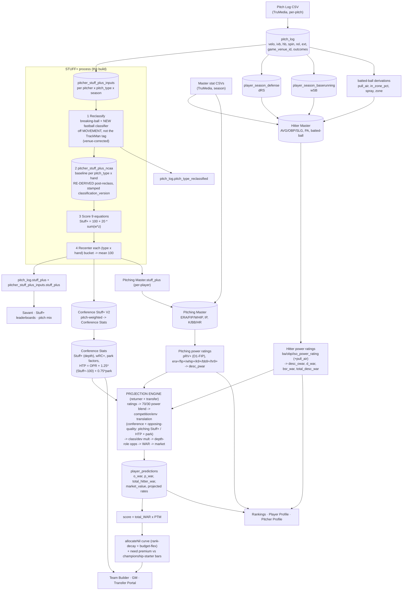

# THE PIPELINE — pitch-log upload → Stuff+ → power ratings → projections → NIL/display (2026-08-17)

The "one process." Today it's **scattered manual scripts**; the goal (Track B) is ONE function that fires on ingest and
runs the whole chain, storing everything. This doc is the map: every stage, what it computes, where it STORES (DB), and
where it DISPLAYS. Companion build plan for the Stuff+ leg: `HANDOFF_STUFF_PLUS_2026_08_16.md`.

## Flow diagram

## Stage table (compute → store → display)

| # | Stage | Computes | Stores (DB) | Displays |
|---|---|---|---|---|
| 1 | Ingest | — | `pitch_log` (per-pitch); `Hitter Master`/`Pitching Master` (season stats) | — |
| 2 | Derive from pitch_log | Stuff+ inputs, dRS defense, wSB baserunning, pull_air/in_zone/spray/zone | `pitcher_stuff_plus_inputs`, `player_season_defense`, `player_season_baserunning`, Master columns | Savant tables |
| 3 | **Stuff+** (the build) | reclassify → re-derive baseline → 9-eq score → recenter | `pitch_log.stuff_plus` + `.pitch_type_reclassified`, `pitcher_stuff_plus_inputs.stuff_plus`, `pitcher_stuff_plus_ncaa`, `Conference Stuff+ (V2)`, `Pitching Master.stuff_plus` | Savant Stuff+ leaderboards, pitch mix |
| 4 | Power ratings (Masters) | hitter ba/obp/iso ratings (+pull_air) → desc WAR; pitcher pRV+/era⁺/… → desc pWAR | `Hitter Master` + `Pitching Master` (ratings + `desc_*` / `total_desc_war` cols) | Player/Pitcher Profile, Rankings |
| 5 | Conference baselines | Conf Stuff+ (depth), wRC+, park factors, HTP | `Conference Stats` | Team Builder context |
| 6 | Projections | returner + transfer engine (blend → competition translation via Stuff+/HTP/park → class/dev → depth-role → WAR → market) | `player_predictions` (o_war, p_war, total_hitter_war, market_value, rates) | Rankings, Profiles, Team Builder, Transfer Portal |
| 7 | NIL + need | score = total_WAR × PTM → allocateNil curve + need premium | (computed live; GM `gm_budget.nil_allocation_mode`) | Team Builder, GM, Target Board |

## Current vs target
- **Current:** stages 2–5 are **scattered one-off scripts run by hand** (`recompute-stuff-plus`, `compute_pitch_log_stuff_plus`, `conferenceStuffPlusV2`, `populate-conference-stats-env-plus`, the Master rating stores, …) — easy to forget → stale baselines/conference values.
- **Target (Track B):** ONE function fires on pitch-log ingest and runs stages 2→6 in order, stamped `classification_version` + `constants_version`, re-deriving every downstream aggregate in the same pass (no old-taxonomy means survive). Stage 1 Master-CSV ingest stays a separate upload; the pipeline marries its pitch-log derivations onto the Masters.
- **Sequencing rule:** Stuff+ (stage 3) must be FINAL before the transfer recompute (stage 6, Step 6b) so projections land once. NIL's `total_hitter_war` + need-premium wiring rides the 6b/7c recompute.
